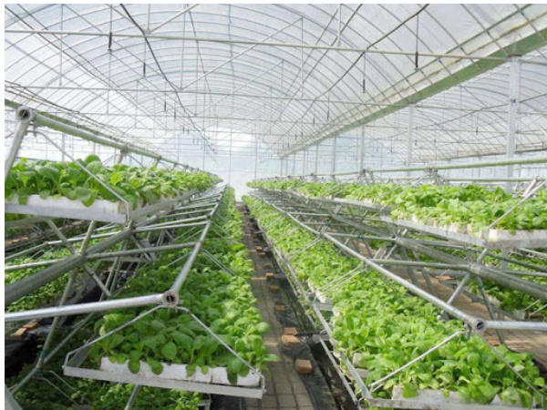
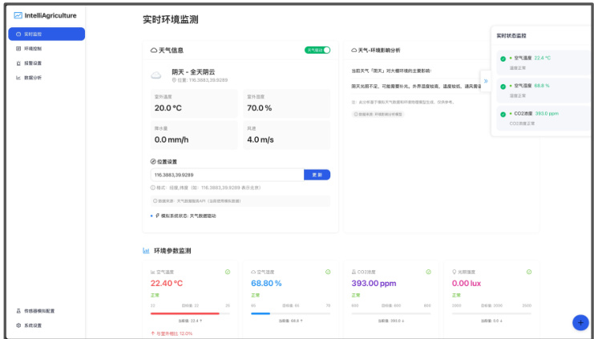

# 自然生态智慧农业大棚控制系统  

指导老师：XXX  

答辩人：陈航  

答辩日期：202X.XX.XX  

软 件 工 程 2 1 2 班  

CONTENT  

# 目   录  

<html><body><table><tr><td>Part 01</td><td>研究背景</td></tr><tr><td>Part 02</td><td>需求分析</td></tr><tr><td>Part 03</td><td>系统架构</td></tr><tr><td>Part 04</td><td>演示</td></tr><tr><td>Part 05</td><td>评估与创新点</td></tr><tr><td>Part 06</td><td>总结与展望</td></tr></table></body></html>  

# 01 研究背景与意义  

随着人口增长与耕地减少，传统农业面临挑战。智能农业融合物联网、AI等技术，实现精准、高效管理。温室作为智能农业核心，其环境控制对作物产量和品质影响显著。研究表明，精确控制温湿度、CO₂浓度可提升产量20%\~30%。  

本系统基于Web平台设计，集成PID与模糊控制算法，实现环境仿真以及大棚内部自动调控：  

  
2020-2026年全球智慧农业市场规模及增长趋势  

效率提升：产量提升25%\~40%人力节省：远程监控降低人工 $60\%$ 精准决策：支持数据驱动的农业策略灵活部署：跨平台、模块化、适配性强  

  

# 系统功能需求分析  

1. 环境监控与控制需求：  

实时监测温度、湿度、光照强度、CO2浓度  提供自动和手动控制：通风系统、加湿系统、补光系统、灌溉系统、CO2系统、遮阳系统  
支持多种控制模式：自动模式、手动模式、定时模式、场景模式  

2. 数据存储与分析需求：  

存储各类环境参数的时间序列数据提供基础统计分析和高级分析功能支持多种数据可视化方式  

3. 系统配置与管理需求：  

环境参数、控制策略和场景模式的配置  
完善的维护管理功能  
多用户角色和权限管理  

# 系统性能需求与可行性分析  

1. 响应时间要求：  

实时监控数据刷新间隔 $\leqslant1$ 秒手动控制命令执行延迟≤500毫秒页面加载时间≤2秒  

2. 数据存储与处理能力：  

支持本地存储至少3个月完整历史数据每秒数据处理量≥1000条记录支持百万级数据快速查询  

3. 系统稳定性指标：  

99.9%的年度运行时间99.99%的数据采集成功率计划外中断时间≤8小时/年系统可行性分析：  

• 经济可行性：采用开源Web技术，降低开发和硬件成本40%-50%技术可行性：所需关键技术已成熟，实现难度可控操作可行性：用户友好的Web界面，操作学习成本低  

# 03系统设计  

# 系统架构  

  

# 前端视图层（View Layer）：  

负责用户界面展示和交互处理采用组件化设计，包括布局组件、功能页面组件等通过React Context API与数据处理层交互  
数据处理层（Processing Layer）：系统核心层，负责业务逻辑处理和状态管理包含传感器数据上下文、控制系统服务等核心服务实现环境数据处理和控制决策  
数据存储层（Storage Layer）：负责数据持久化内存缓存：存储高频实时数据IndexedDB：存储长期历史数据LocalStorage：存储系统配置  

  

# 控制系统设计  

# PID控制器：适用于线性系统  

工作原理：根据误差信号计算比例项、积分项和微分项应用：补光系统、CO2系统和遮阳系统  

# 模糊控制器：适用于非线性系统  

工作原理：模糊化、模糊规则推理、解模糊化应用：加湿系统和灌溉系统  

# Smith预测控制器：适用于大延迟系统  

工作原理：通过内部模型预测补偿系统延迟应用：通风系统  

  

# 03系统设计  

# 控制系统设计  

  
控制系统整体架构  

  
子系统控制特性  

  
控制系统协同工作  

# 数据存储机制设计  

# 双层存储架构设计：  

内存缓存层：使用JavaScript数据结构存储最近数据持久化存储层：使用IndexedDB数据库存储长期数据  

# 数据采样策略：根据数据年龄采用不同策略  

实时数据 （最近1分钟）：每1秒采样，完整保存短期数据 （最近1小时）：每1分钟采样，存储平均值中期数据（最近24小时）：每30分钟采样，存储统计值长期数据 （最近1个月）：每1小时采样，存储统计摘要历史数据 （1个月以上）：每1天采样，存储日统计数据  

# 数据清理机制：结合定期清理、容量触发清理和重要性清理  

  
数据实体关系图  

# 03系统设计  

  
数据采样策略  

# 前端技术和实现  

# 核心前端技术：  

TypeScript语言：静态类型检查，提高代码质量React框架：组件化开发，状态管理简洁Ant Design组件库：提供美观且功能完善的UI组件ECharts可视化库：实现丰富的数据可视化  

# 组件化设计：  

应用级组件：App和Layout组件，负责整体结构  
页面级组件：Dashboard和EnvironmentControl等，对应主要功能  
功能级组件：ParameterCard和ControlPanel等，实现具体功能  
通用UI级组件：Button、Chart等基础UI元素  

# 状态管理：  

全局状态：使用React Context API管理传感器数据、系统设置局部状态：使用useState管理UI状态和临时数据  

  

  

  
主界面  
控制系统开关与功率修改  

  
报警设置   
数据日志与分析  

  
传感器数据模拟源  

  
系统设置  

# 多级控制架构设计：  

集成PID控制、模糊控制和Smith预测控制三种先进算法控制器工厂模式实现算法与子系统解耦为不同特性的环境参数选择最适合的控制算法  

# 高效数据存储机制：  

双层数据存储架构平衡性能和存储需求动态采样策略降低存储压力概率触发清理机制保障长期运行稳定  

# 基于天气数据的环境模拟：  

使用真实天气数据驱动环境模拟建立环境参数间的物理关联模型控制系统操作对环境参数的精确反馈  

# 响应式UI设计与离线计算：  

浏览器端实现复杂的数据处理和计算响应式设计适应不同设备优化的数据可视化提升用户体验  

# 06总结与展望  

# 本研究设计并实现了一套智慧农业大棚环境控制系统仿真平台，主要成果包括：  

# 系统设计与实现：  

采用分层架构设计，模块化结构支持功能扩展实现了环境监测、环境控制、数据分析和系统设置等核心功能开发了用户友好的操作界面，便于操作使用  

# 技术创新：  

控制算法：设计了PID控制和模糊控制相结合的混合控制方案数据存储：优化了数据存储结构，平衡实时性和存储效率用户界面：开发了一套直观的数据可视化组件  

# 系统测试与评估：  

功能测试：验证系统各项功能正常工作性能测试：系统响应时间和资源占用在合理范围用户评估：用户对系统易用性给予了积极评价  

# 06总结与展望  

# 系统优势分析：  

1. 功能完备性：实现了智能温室环境监测的核心功能，包括环境参数采集、自动化控制、数据分析和实时监控等  
2. 控制精度和实时性：传感器数据采集精度高，控制响应速度快，平均响应时间约830毫秒  
3. 系统可靠性：长期运行测试证明系统稳定，连续运行30天无崩溃  

# 系统不足分析：  

• 高级功能易用性：数据分析功能用户满意度评分仅3.5分，高级查询和配置界面较复杂  
• 移动端适配：小屏幕上的图表展示效果不佳，触摸操作精度不高，部分高级功能在移动端无法使用  
扩展性局限：设备接入需要手动配置，不同厂商设备适配存在困难  
• 智能决策支持薄弱：缺乏智能预测功能，控制策略优化过度依赖人工操作  

# 感谢各位专家老师批评指正  

T H A N K S  F O R  Y O U R  A T T E N T I O N  