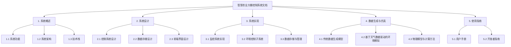

# 自然生态智慧农业大棚控制系统文档

本文档集提供了自然生态智慧农业大棚控制系统的完整技术文档，包括系统架构、设计原理、实现细节和使用指南。

## 文档结构

## 文档导航

### 1. [系统概述](overview/system-overview.md)
- **[1.1 系统功能](overview/system-overview.md#11-系统功能)**：核心功能模块和应用场景
- **[1.2 系统架构](overview/system-overview.md#12-系统架构)**：架构层次、核心组件和数据流
- **[1.3 技术栈](overview/system-overview.md#13-技术栈)**：前端核心技术、数据处理与存储、计算与算法

### 2. 系统设计
- **[2.1 控制系统设计](design/control-system-design.md)**：控制算法选型与实现
  - [2.1.1 控制系统架构](design/control-system-design.md#211-控制系统架构)
  - [2.1.2 先进控制算法](design/control-system-design.md#212-先进控制算法)
  - [2.1.3 控制算法应用](design/control-system-design.md#213-控制算法应用)
- **[2.2 数据存储机制](design/data-storage-mechanism.md)**：多层存储策略与数据管理
- **2.3 前端界面设计**：用户界面组件与交互设计

### 3. 系统实现
- **3.1 监控系统实现**：实时数据采集、可视化和报警机制
- **3.2 环境控制子系统**：各子系统的实现逻辑和工作流程
- **3.3 数据存储与管理**：数据存储和管理的具体实现方式

### 4. [数据生成与仿真](simulation/data-generation-simulation.md)
- **[4.1 传统数据生成模型](simulation/data-generation-simulation.md#41-传统数据生成模型)**：基于三角函数的随机数据生成，现已集成控制系统效果。
- **[4.2 基于天气数据驱动的环境模拟](simulation/data-generation-simulation.md#42-基于天气数据驱动的环境模拟)**：结合真实天气数据与大棚物理模型进行高精度环境模拟，室内温度变化更平滑且受历史状态影响。
- **[4.3 物理模型与计算方法](simulation/data-generation-simulation.md#43-物理模型与计算方法)**：环境参数计算的物理模型，包括热量传递和控制系统影响的量化。
- **[4.4 天气驱动模型的优势与应用](simulation/data-generation-simulation.md#44-天气驱动模型的优势与应用)**：模型比较和应用场景。

### 5. 使用指南
- **5.1 用户手册**：系统操作指导和功能说明
- **5.2 开发者指南**：二次开发和系统扩展指导

## 系统特点

- **实时监控与可视化**：通过直观的界面实时展示大棚环境参数和设备状态，优化了报警设置和滑块交互体验。
- **智能控制算法**：基于PID、模糊控制和Smith预测控制的先进控制算法，控制效果在模拟环境中得到更精确体现。
- **多子系统协同工作**：通风、加湿、补光、灌溉、CO2补充和加热制冷等子系统协同控制。
- **双模环境模拟**：
    - **天气数据驱动模式**：利用真实天气数据和基于上一时刻状态的物理模型实现高精度、平滑的环境参数变化模拟。
    - **传统波形模式**：基于三角函数生成基础数据，并集成控制系统效果，适用于特定场景测试。
- **响应式设计**：适应不同设备的用户界面。
- **离线存储与计算**：基于浏览器的数据存储和计算能力。
- **可扩展架构**：模块化设计支持功能扩展。

## 环境模拟方案比较

| 方案 | 优点 | 局限性 | 适用场景 |
|-----|-----|-------|---------|
| 传统波形模拟 | 实现相对简单，计算量小，可预测性强，现已集成控制系统效果 | 参数间物理关联性较弱（相较于天气驱动），更依赖预设波形 | 系统原型演示，特定参数响应测试 |
| 天气数据驱动模型 | 更真实的环境模拟，考虑外部天气因素和历史状态，环境参数变化平滑，控制系统效果精确反馈 | 需要天气数据输入，计算逻辑相对复杂 | 生产环境模拟，复杂场景测试，控制策略验证，操作员培训 |

## 天气数据驱动模拟核心优势

- **高保真环境参数联动**：各参数间存在更真实的物理关联，如温度变化考虑历史状态、热传递、太阳辐射及控制设备影响，湿度、CO2等参数也相应调整。
- **控制系统精确反馈**：控制系统的操作（如加热器功率调整）能够更精确、平滑地反映在环境参数变化上，符合物理预期。
- **场景适应性强**：通过调整大棚物理参数，可以模拟不同类型的大棚环境。
- **培训与验证价值**：更真实的环境模拟使系统成为培训和验证控制策略的有效工具，能更好地展示控制逻辑的实际效果。

## 文档更新

| 日期       | 版本 | 更新内容               | 更新人   |
|------------|------|------------------------|----------|
| 2023-11-10 | v1.0 | 初始文档创建           | 开发团队 |
| 2024-05-18 | v3.0 | 增加天气驱动环境模拟   | 开发团队 |
| 2024-05-25 | v3.1 | 文档优化及冗余删除     | 开发团队 |
| 2024-05-28 | v3.2 | 更新环境模拟逻辑，修复UI交互，完善报警设置文档 | 开发团队 | 