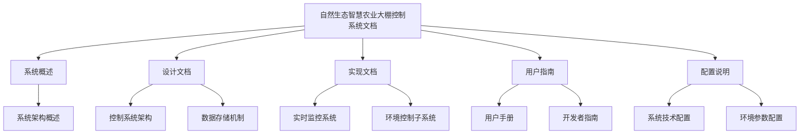

# 自然生态智慧农业大棚控制系统文档

本文档集提供了自然生态智慧农业大棚控制系统的完整技术文档，包括系统设计、架构、实现方案和配置说明。

## 文档结构

## 文档内容概述

### 系统概述

- **系统架构概述**: 描述系统的整体架构、分层结构、模块划分和数据流。

### 设计文档

- **控制系统架构**: 详细说明控制系统的设计原理、控制算法选择和参数配置。
- **数据存储机制**: 描述系统的数据存储架构、缓存策略和数据管理机制。

### 实现文档

- **实时监控系统**: 详细介绍实时数据采集、可视化和报警机制的实现方法。
- **环境控制子系统**: 说明各环境控制子系统的实现逻辑和工作流程。

### 用户指南

- **用户手册**: 为系统操作者提供详细的操作指导和功能说明。
- **开发者指南**: 为技术人员提供系统二次开发和扩展的指导。

### 配置说明

- **系统技术配置**: 介绍系统的技术栈、开发环境和工具配置。
- **环境参数配置**: 说明环境参数的配置方式和最佳实践。

## 技术栈

本系统采用现代前端技术栈开发，主要包括：

- **框架**: React、TypeScript
- **UI组件**: Ant Design
- **数据可视化**: ECharts
- **状态管理**: Context API
- **数据存储**: IndexedDB
- **构建工具**: Vite

## 系统特点

自然生态智慧农业大棚控制系统具有以下主要特点：

1. **实时监控**: 实时采集并展示大棚环境数据，包括温度、湿度、光照、CO2浓度等参数。

2. **智能控制**: 采用多种控制算法（PID、模糊控制、Smith预测控制）实现精确的环境参数调控。

3. **数据分析**: 提供环境数据的趋势分析、相关性分析和预测分析功能。

4. **报警机制**: 当环境参数异常时，系统自动生成报警并提供处理建议。

5. **响应式设计**: 系统界面自适应不同设备，支持PC、平板和手机访问。

6. **离线存储**: 利用浏览器IndexedDB实现数据的本地存储，减少网络依赖。

7. **可扩展性**: 系统采用模块化设计，便于扩展新功能和适应不同类型的农业大棚。

## 主要功能模块

- **实时监控面板**: 展示当前环境参数和设备状态
- **环境控制界面**: 操作各控制子系统，调节环境参数
- **数据分析中心**: 查看历史数据和分析报告
- **系统配置**: 设置控制参数、报警阈值和用户偏好
- **报警管理**: 查看和处理历史报警记录

## 系统截图

//TODO: 添加系统主要界面截图

## 文档更新

本文档持续更新中，如有问题或建议，请联系开发团队。

## 文档维护

本文档由开发团队维护更新。如发现问题或有改进建议，请提交Issue或联系项目负责人。

### 文档更新日志

| 日期 | 版本 | 更新内容 | 更新人 |
|------|------|---------|--------|
| 2023-11-10 | v1.0 | 初始文档创建 | 开发团队 |
| 2023-12-15 | v1.1 | 补充技术配置文档 | 开发团队 |
| 2024-01-20 | v1.2 | 更新系统架构图 | 开发团队 |
| 2024-03-05 | v2.0 | 重组文档结构，增加Mermaid图表 | 开发团队 |
| 2024-04-30 | v2.1 | 添加用户手册 | 开发团队 |
| 2024-05-01 | v2.2 | 添加开发者指南 | 开发团队 | 