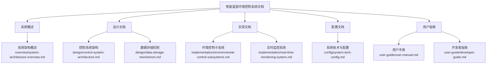

# 智能温室环境控制系统文档

本文档集提供了智能温室环境控制系统的完整技术文档，包括系统设计、架构、实现方案和配置说明。

## 文档结构

## 文档内容索引

### 1. 系统概述

* [**系统架构概述**](overview/system-architecture-overview.md) - 提供系统整体架构、功能模块和工作流程的高级概述

### 2. 设计文档

* [**控制系统架构**](design/control-system-architecture.md) - 详细描述控制系统的设计原理、架构和算法
* [**数据存储机制**](design/data-storage-mechanism.md) - 详细描述系统数据存储架构和策略

### 3. 实现文档

* [**环境控制子系统**](implementation/environmental-control-subsystems.md) - 详细描述各环境控制子系统的实现方法
* [**实时监控系统**](implementation/real-time-monitoring-system.md) - 详细描述实时监控系统的实现方法

### 4. 配置文档

* [**系统技术与配置**](config/system-tech-config.md) - 详细描述系统使用的技术栈和配置参数

### 5. 用户指南

* [**用户手册**](user-guide/user-manual.md) - 面向最终用户的系统使用指南
* [**开发者指南**](user-guide/developer-guide.md) - 面向开发人员的代码开发与扩展指南

## 使用指南

### 针对开发人员

如果您是开发人员，建议按照以下顺序阅读文档：

1. 首先阅读[系统架构概述](overview/system-architecture-overview.md)了解系统整体结构
2. 然后阅读[系统技术与配置](config/system-tech-config.md)了解技术栈和配置
3. 接着阅读设计文档了解系统设计原理
4. 参考[开发者指南](user-guide/developer-guide.md)了解如何进行代码开发和扩展
5. 最后阅读实现文档了解具体实现细节

### 针对运维人员

如果您是运维人员，建议按照以下顺序阅读文档：

1. 首先阅读[系统架构概述](overview/system-architecture-overview.md)了解系统整体结构
2. 然后重点阅读[系统技术与配置](config/system-tech-config.md)了解配置参数
3. 最后参考[数据存储机制](design/data-storage-mechanism.md)了解数据维护相关内容

### 针对使用者

如果您是系统使用者，建议阅读：

1. [用户手册](user-guide/user-manual.md)了解系统基本操作和功能
2. 参考[实时监控系统](implementation/real-time-monitoring-system.md)进一步了解监控功能

## 文档维护

本文档由开发团队维护更新。如发现问题或有改进建议，请提交Issue或联系项目负责人。

### 文档更新日志

| 日期 | 版本 | 更新内容 | 更新人 |
|------|------|---------|--------|
| 2023-11-10 | v1.0 | 初始文档创建 | 开发团队 |
| 2023-12-15 | v1.1 | 补充技术配置文档 | 开发团队 |
| 2024-01-20 | v1.2 | 更新系统架构图 | 开发团队 |
| 2024-03-05 | v2.0 | 重组文档结构，增加Mermaid图表 | 开发团队 |
| 2024-04-30 | v2.1 | 添加用户手册 | 开发团队 |
| 2024-05-01 | v2.2 | 添加开发者指南 | 开发团队 | 