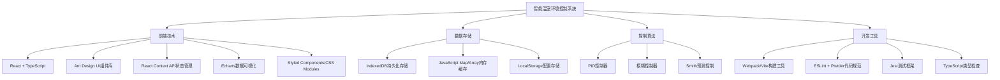
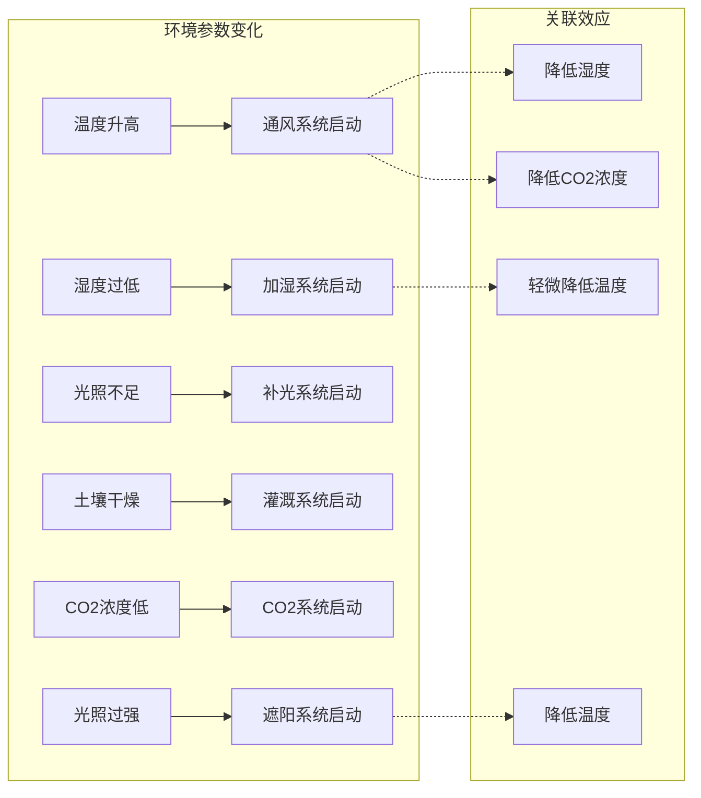

# 智能温室环境控制系统技术与配置介绍

## 1. 技术栈概述

智能温室环境控制系统采用现代前端技术栈构建，主要包括：



## 2. 系统运行环境

### 2.1 客户端环境要求

- **浏览器兼容性**：
  - Chrome 80+
  - Firefox 75+
  - Edge 80+
  - Safari 13+
  
- **设备支持**：
  - 桌面端（推荐）
  - 平板设备
  - 移动设备（响应式支持）

- **推荐系统配置**：
  - 处理器：现代多核处理器
  - 内存：4GB及以上
  - 存储空间：500MB可用空间（用于数据缓存）

### 2.2 服务端环境

本系统主要为客户端应用，数据存储于浏览器IndexedDB中。如需部署服务端：

- **Web服务器**：Nginx/Apache/Node.js
- **部署方式**：静态文件部署
- **HTTPS支持**：推荐启用，保证数据传输安全

## 3. 系统配置参数

### 3.1 环境参数配置

| 参数 | 配置项 | 默认值 | 单位 | 说明 |
|------|------|--------|-----|------|
| 空气温度 | min | 20 | °C | 最低允许温度 |
| | max | 30 | °C | 最高允许温度 |
| | target | 25 | °C | 目标温度 |
| | warningThreshold | 30 | °C | 警告阈值 |
| | criticalThreshold | 35 | °C | 临界阈值 |
| 空气湿度 | min | 60 | % | 最低允许湿度 |
| | max | 80 | % | 最高允许湿度 |
| | target | 70 | % | 目标湿度 |
| | warningThreshold | 80 | % | 警告阈值 |
| | criticalThreshold | 85 | % | 临界阈值 |
| 土壤湿度 | min | 70 | % | 最低允许湿度 |
| | max | 85 | % | 最高允许湿度 |
| | target | 75 | % | 目标湿度 |
| | warningThreshold | 85 | % | 警告阈值 |
| CO2浓度 | min | 400 | ppm | 最低浓度 |
| | max | 800 | ppm | 最高浓度 |
| | target | 600 | ppm | 目标浓度 |
| | warningThreshold | 800 | ppm | 警告阈值 |
| 光照强度 | min | 2000 | lux | 最低光照 |
| | max | 3000 | lux | 最高光照 |
| | target | 2500 | lux | 目标光照 |
| | warningThreshold | 3000 | lux | 警告阈值 |

### 3.2 控制算法参数

#### 3.2.1 PID控制器参数

```typescript
pid: {
  defaultKp: 0.2,  // 比例系数
  defaultKi: 0.05, // 积分系数
  defaultKd: 0.1,  // 微分系数
  maxIntegral: 100 // 积分限幅
}
```

#### 3.2.2 模糊控制器参数

```typescript
fuzzy: {
  membershipRanges: {
    error: [-10, -5, 0, 5, 10],           // 误差隶属度范围
    errorChange: [-2, -1, 0, 1, 2]        // 误差变化率隶属度范围
  },
  rules: [                                // 模糊规则矩阵
    [0.0, 0.2, 0.4, 0.6, 0.8],
    [0.2, 0.4, 0.6, 0.8, 1.0],
    [0.4, 0.6, 0.8, 1.0, 0.8],
    [0.6, 0.8, 1.0, 0.8, 0.6],
    [0.8, 1.0, 0.8, 0.6, 0.4]
  ]
}
```

#### 3.2.3 Smith预测控制器参数

```typescript
smith: {
  deadTime: 5,        // 系统死区时间（秒）
  timeConstant: 30,   // 系统时间常数（秒）
  modelGain: 1.2      // 模型增益
}
```

### 3.3 系统响应参数

```typescript
systemConfig: {
  updateIntervals: {
    sensorData: 1000,    // 传感器数据更新间隔（毫秒）
    systemStatus: 5000,  // 系统状态更新间隔（毫秒）
    controlLoop: 1000    // 控制循环间隔（毫秒）
  },
  powerControl: {
    minStep: 1,          // 最小调节步长（%）
    maxStep: 10,         // 最大调节步长（%）
    rampRate: 5          // 功率变化斜率限制（%/秒）
  }
}
```

### 3.4 数据存储配置

```typescript
storageConfig: {
  maxSize: 100 * 1024 * 1024,  // 数据库最大大小（100MB）
  samplingIntervals: {
    lastMinute: 1,     // 1秒采样
    lastHour: 60,      // 1分钟采样
    lastDay: 1800,     // 30分钟采样
    lastMonth: 3600    // 1小时采样
  },
  retention: {
    default: 7 * 24 * 60 * 60 * 1000,  // 默认保留7天数据
    warningLogs: 30 * 24 * 60 * 60 * 1000  // 报警日志保留30天
  }
}
```

## 4. 子系统配置与特性

### 4.1 子系统控制特性对照表

| 子系统 | 控制算法 | 响应特性 | 主要参数 |
|-------|---------|---------|--------|
| 通风系统 | Smith预测控制 | 大延迟系统 | 空气温度、空气湿度 |
| 加湿系统 | 模糊控制 | 非线性系统 | 空气湿度 |
| 补光系统 | PID控制 | 线性系统 | 光照强度 |
| 灌溉系统 | 模糊控制 | 非线性系统 | 土壤湿度、土壤温度 |
| CO2系统 | PID控制 | 线性系统 | CO2浓度 |
| 遮阳系统 | PID控制 | 线性系统 | 光照强度 |

### 4.2 控制系统响应特性



## 5. 系统优化配置

### 5.1 性能优化配置

- **React优化**：
  - 使用React.memo减少不必要的渲染
  - 使用useCallback和useMemo缓存函数和计算结果
  - 实现虚拟滚动处理大量数据渲染

- **数据优化**：
  - 使用多级采样策略减少数据存储量
  - 数据压缩存储（JSON优化）
  - 惰性加载历史数据

- **渲染优化**：
  - Canvas优化图表渲染
  - 防抖和节流处理频繁更新
  - 分批处理大量数据更新

### 5.2 建议系统配置调优

```typescript
// 生产环境配置建议
productionConfig: {
  updateIntervals: {
    sensorData: 2000,      // 增加到2秒，减少计算压力
    systemStatus: 10000,   // 增加到10秒，减少渲染压力
  },
  storage: {
    compressionEnabled: true,  // 启用数据压缩
    samplingIntervals: {
      lastMinute: 5,       // 5秒采样，减少存储压力
    }
  },
  ui: {
    animationEnabled: false,   // 关闭动画效果
    virtualScrollingThreshold: 100  // 超过100项启用虚拟滚动
  }
}
```

## 6. 开发与调试配置

### 6.1 开发环境配置

```typescript
// 开发环境推荐配置
devConfig: {
  updateIntervals: {
    sensorData: 1000,     // 1秒，方便调试
  },
  mock: {
    enabled: true,        // 启用模拟数据
    randomSeed: 12345,    // 固定随机种子，便于复现问题
    variationRange: 0.2   // 20%的随机变化范围
  },
  storage: {
    inMemoryOnly: true    // 仅使用内存存储，避免污染IndexedDB
  },
  debug: {
    logLevel: 'verbose',  // 详细日志
    consoleReport: true,  // 控制台报告
    timeseriesMonitor: true  // 监控时序数据
  }
}
```

### 6.2 调试工具配置

- **Chrome DevTools扩展**：
  - React Developer Tools
  - IndexedDB查看器
  - 性能监控器

- **在线分析工具**：
  - 前端性能监控
  - 耗时操作分析
  - 内存泄漏检测

## 7. 配置文件路径与格式

系统配置文件主要集中在以下位置：

| 配置类型 | 文件路径 | 格式 |
|---------|---------|------|
| 环境参数 | src/config/environmentConfig.ts | TypeScript对象 |
| 控制算法 | src/config/controlModelConfig.ts | TypeScript对象 |
| 系统参数 | src/config/systemConfig.ts | TypeScript对象 |
| UI配置 | src/config/uiConfig.ts | TypeScript对象 |
| 开发配置 | .env.development | 环境变量 |
| 生产配置 | .env.production | 环境变量 |

## 8. 技术扩展与集成

### 8.1 API集成扩展

系统预留了与外部系统集成的接口：

```typescript
// 远程数据接口
interface RemoteDataService {
  fetchSensorData(): Promise<SensorData[]>;
  sendControlCommand(system: string, command: ControlCommand): Promise<void>;
  syncSettings(settings: SystemSettings): Promise<void>;
}

// AI预测接口
interface PredictionService {
  predictEnvironment(current: SensorData, hours: number): Promise<SensorData[]>;
  suggestOptimalSettings(plantType: string): Promise<Partial<SystemSettings>>;
}
```

### 8.2 硬件接口配置

针对实际硬件的配置参数：

```typescript
// 硬件接口配置
hardwareConfig: {
  sensors: {
    temperatureSensor: {
      type: 'DHT22',
      pinMapping: 'GPIO4',
      readInterval: 5000, // 5秒读取一次
      calibrationOffset: -0.5 // 校准偏移
    },
    humiditySensor: {
      type: 'DHT22',
      pinMapping: 'GPIO4',
      readInterval: 5000,
      calibrationOffset: 2.0
    }
    // 其他传感器配置...
  },
  actuators: {
    ventilationFan: {
      type: 'PWM',
      pinMapping: 'GPIO18',
      frequency: 25000, // 25kHz PWM频率
      minDutyCycle: 0.2, // 最小20%占空比
      maxDutyCycle: 1.0
    }
    // 其他执行器配置...
  },
  communicationProtocol: {
    type: 'MQTT',
    broker: 'mqtt://broker.example.com',
    clientId: 'greenhouse-controller',
    topicPrefix: 'greenhouse/',
    qos: 1
  }
}
``` 