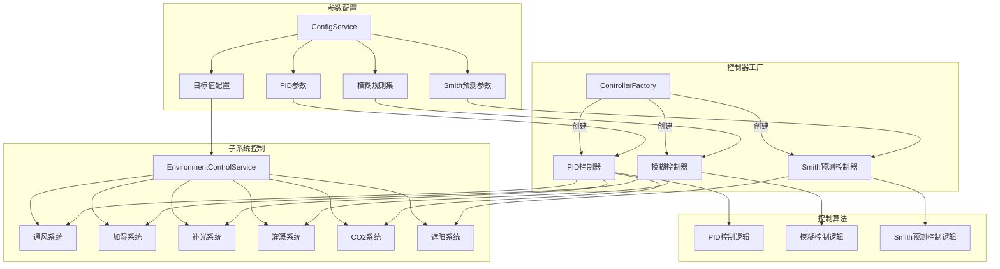

# 控制系统架构设计

## 一、控制系统整体架构

自然生态智慧农业大棚控制系统采用多级控制架构，包含智能控制器工厂、各类控制算法及其参数化配置：



## 二、控制器设计

系统实现了三种不同特性的控制器，以适应不同环境参数的控制需求：

### 2.1 PID控制器

**文件位置**：`src/controllers/PIDController.ts`

PID控制器适用于线性特性明显的控制对象，如补光系统和CO2系统：

```typescript
export class PIDController implements Controller {
  private kp: number;  // 比例系数
  private ki: number;  // 积分系数
  private kd: number;  // 微分系数
  private integralTerm: number = 0;  // 积分项
  private lastError: number = 0;  // 上一次的误差
  private outputMin: number;  // 输出下限
  private outputMax: number;  // 输出上限
  private sampleTime: number;  // 采样时间(ms)
  private lastSampleTime: number = 0;  // 上次采样时间

  constructor(params: PIDParams) {
    this.kp = params.kp;
    this.ki = params.ki;
    this.kd = params.kd;
    this.outputMin = params.outputMin || 0;
    this.outputMax = params.outputMax || 100;
    this.sampleTime = params.sampleTime || 1000;
  }

  calculate(setpoint: number, processValue: number): number {
    const currentTime = Date.now();
    const deltaTime = (currentTime - this.lastSampleTime) / 1000; // 转换为秒
    
    // 如果时间间隔过小，直接返回上次结果
    if (deltaTime < this.sampleTime / 1000 && this.lastSampleTime !== 0) {
      return this.clamp(this.lastOutput);
    }
    
    // 计算误差
    const error = setpoint - processValue;
    
    // 比例项
    const proportionalTerm = this.kp * error;
    
    // 积分项 (考虑时间因素)
    this.integralTerm += this.ki * error * deltaTime;
    this.integralTerm = this.clamp(this.integralTerm); // 防止积分饱和
    
    // 微分项 (考虑时间因素)
    const derivativeTerm = deltaTime > 0 ? 
      this.kd * (error - this.lastError) / deltaTime : 0;
    
    // 计算总输出
    const output = proportionalTerm + this.integralTerm + derivativeTerm;
    
    // 更新状态
    this.lastError = error;
export class ControllerFactory {
  static createController(type: 'pid' | 'fuzzy' | 'smith'): PIDController | FuzzyController | SmithPredictor {
    switch (type) {
      case 'pid':
        return new PIDController();
      case 'fuzzy':
        return new FuzzyController();
      case 'smith':
        return new SmithPredictor();
      default:
        throw new Error('Unknown controller type');
    }
  }
}
```

### 2.2 PID控制器

PID控制器适用于具有线性特性的系统，如补光系统、CO2系统：

```typescript
export class PIDController {
  private kp: number;
  private ki: number;
  private kd: number;
  private maxIntegral: number;
  private integral: number = 0;
  private lastError: number = 0;
  private lastTime: number = Date.now();

  constructor(
    kp = controlModelConfig.pid.defaultKp,
    ki = controlModelConfig.pid.defaultKi,
    kd = controlModelConfig.pid.defaultKd,
    maxIntegral = controlModelConfig.pid.maxIntegral
  ) {
    this.kp = kp;
    this.ki = ki;
    this.kd = kd;
    this.maxIntegral = maxIntegral;
  }

  calculate(setpoint: number, processValue: number): number {
    const now = Date.now();
    const dt = (now - this.lastTime) / 1000; // 转换为秒
    
    // 计算误差
    const error = setpoint - processValue;
    
    // 计算积分项
    this.integral += error * dt;
    this.integral = Math.max(-this.maxIntegral, Math.min(this.maxIntegral, this.integral));
    
    // 计算微分项
    const derivative = (error - this.lastError) / dt;
    
    // 计算输出
    const output = this.kp * error + this.ki * this.integral + this.kd * derivative;
    
    // 更新状态
    this.lastError = error;
    this.lastTime = now;
    
    return Math.max(0, Math.min(100, output));
  }

  reset(): void {
    this.integral = 0;
    this.lastError = 0;
    this.lastTime = Date.now();
  }
}
```

#### PID控制器参数配置

```typescript
pid: {
  defaultKp: 0.2,  // 比例系数
  defaultKi: 0.05, // 积分系数
  defaultKd: 0.1,  // 微分系数
  maxIntegral: 100 // 积分限幅
}
```

### 2.3 模糊控制器

模糊控制器适用于非线性特性明显的系统，如加湿系统、灌溉系统：

```typescript
export class FuzzyController {
  private rules: number[][];
  private errorRanges: number[];
  private errorChangeRanges: number[];

  constructor() {
    this.rules = controlModelConfig.fuzzy.rules;
    this.errorRanges = controlModelConfig.fuzzy.membershipRanges.error;
    this.errorChangeRanges = controlModelConfig.fuzzy.membershipRanges.errorChange;
  }

  private getMembership(value: number, ranges: number[]): number[] {
    const memberships = new Array(ranges.length).fill(0);
    
    for (let i = 0; i < ranges.length - 1; i++) {
      if (value >= ranges[i] && value <= ranges[i + 1]) {
        memberships[i] = (ranges[i + 1] - value) / (ranges[i + 1] - ranges[i]);
        memberships[i + 1] = (value - ranges[i]) / (ranges[i + 1] - ranges[i]);
      }
    }
    
    return memberships;
  }

  calculate(error: number, errorChange: number): number {
    // 计算误差和误差变化率的隶属度
    const errorMemberships = this.getMembership(error, this.errorRanges);
    const errorChangeMemberships = this.getMembership(errorChange, this.errorChangeRanges);
    
    let outputSum = 0;
    let membershipSum = 0;
    
    // 模糊推理
    for (let i = 0; i < errorMemberships.length; i++) {
      for (let j = 0; j < errorChangeMemberships.length; j++) {
        const ruleMembership = Math.min(errorMemberships[i], errorChangeMemberships[j]);
        outputSum += ruleMembership * this.rules[i][j];
        membershipSum += ruleMembership;
      }
    }
    
    // 重心法解模糊化
    return membershipSum > 0 ? (outputSum / membershipSum) * 100 : 0;
  }
}
```

#### 模糊控制器参数配置

```typescript
fuzzy: {
  membershipRanges: {
    error: [-10, -5, 0, 5, 10],           // 误差隶属度范围
    errorChange: [-2, -1, 0, 1, 2]        // 误差变化率隶属度范围
  },
  rules: [                                // 模糊规则矩阵
    [0.0, 0.2, 0.4, 0.6, 0.8],
    [0.2, 0.4, 0.6, 0.8, 1.0],
    [0.4, 0.6, 0.8, 1.0, 0.8],
    [0.6, 0.8, 1.0, 0.8, 0.6],
    [0.8, 1.0, 0.8, 0.6, 0.4]
  ]
}
```

### 2.4 Smith预测控制器

Smith预测控制器适用于具有大延迟特性的系统，如通风系统：

```typescript
export class SmithPredictor {
  private deadTime: number;
  private timeConstant: number;
  private modelGain: number;
  private processModel: number[] = [];
  private pidController: PIDController;

  constructor() {
    this.deadTime = controlModelConfig.smith.deadTime;
    this.timeConstant = controlModelConfig.smith.timeConstant;
    this.modelGain = controlModelConfig.smith.modelGain;
    this.pidController = new PIDController();
    
    // 初始化过程模型
    this.processModel = new Array(Math.ceil(this.deadTime)).fill(0);
  }

  private updateModel(input: number): number {
    // 一阶系统模型
    const modelOutput = this.processModel[this.processModel.length - 1];
    const newOutput = modelOutput + 
      (this.modelGain * input - modelOutput) * (1 / this.timeConstant);
    
    // 更新延迟队列
    this.processModel.shift();
    this.processModel.push(newOutput);
    
    return this.processModel[0];
  }

  calculate(setpoint: number, processValue: number): number {
    // 计算PID输出
    const pidOutput = this.pidController.calculate(setpoint, processValue);
    
    // 更新模型预测值
    const modelPrediction = this.updateModel(pidOutput);
    
    // 计算模型误差补偿
    const modelError = processValue - modelPrediction;
    
    // 补偿后的控制输出
    return Math.max(0, Math.min(100, pidOutput + modelError));
  }

  reset(): void {
    this.pidController.reset();
    this.processModel = new Array(Math.ceil(this.deadTime)).fill(0);
  }
}
```

#### Smith预测控制器参数配置

```typescript
smith: {
  deadTime: 5,        // 系统死区时间（秒）
  timeConstant: 30,   // 系统时间常数（秒）
  modelGain: 1.2      // 模型增益
}
```

## 3. 控制系统实现

**文件位置**：`src/services/ControlSystem.ts`

控制系统类负责创建和管理各子系统的控制器，并实现控制算法：

```typescript
class ControlSystem {
  private controllers: Map<string, any> = new Map();
  private lastErrors: Map<string, number> = new Map();
  private lastUpdate: number = Date.now();

  constructor() {
    // 为每个子系统初始化控制器
    this.initializeControllers();
  }

  private initializeControllers(): void {
    // 通风系统使用Smith预测控制器（适合大延迟系统）
    this.controllers.set('ventilation', ControllerFactory.createController('smith'));
    
    // 加湿系统使用模糊控制器（适合非线性系统）
    this.controllers.set('humidification', ControllerFactory.createController('fuzzy'));
    
    // 补光系统使用PID控制器（适合线性系统）
    this.controllers.set('lighting', ControllerFactory.createController('pid'));
    
    // 灌溉系统使用模糊控制器（适合非线性系统）
    this.controllers.set('irrigation', ControllerFactory.createController('fuzzy'));
    
    // CO2系统使用PID控制器
    this.controllers.set('co2', ControllerFactory.createController('pid'));
    
    // 遮阳系统使用PID控制器
    this.controllers.set('shading', ControllerFactory.createController('pid'));
  }
}
```

### 3.1 子系统控制实现

#### 通风系统控制

```typescript
calculateVentilationControl(sensorData: SensorData): SystemOutput {
  const controller = this.controllers.get('ventilation');
  const tempError = sensorData.airTemperature - environmentConfig.airTemperature.target;
  const humidityError = sensorData.airHumidity - environmentConfig.airHumidity.target;
  
  // 使用较大的误差作为控制输入
  const error = Math.max(
    tempError / (environmentConfig.airTemperature.warningThreshold - environmentConfig.airTemperature.target),
    humidityError / (environmentConfig.airHumidity.warningThreshold - environmentConfig.airHumidity.target)
  ) * 100;

  const power = controller.calculate(0, error);
  
  return {
    power,
    status: this.getVentilationStatus(sensorData),
    controlMode: 'smith'
  };
}
```

#### 加湿系统控制

```typescript
calculateHumidificationControl(sensorData: SensorData): SystemOutput {
  const controller = this.controllers.get('humidification');
  const error = environmentConfig.airHumidity.target - sensorData.airHumidity;
  const errorChange = this.getErrorChange('humidification', error);
  
  const power = controller.calculate(error, errorChange);
  
  return {
    power,
    status: this.getHumidificationStatus(sensorData),
    controlMode: 'fuzzy'
  };
}
```

#### 补光系统控制

```typescript
calculateLightingControl(sensorData: SensorData): SystemOutput {
  const controller = this.controllers.get('lighting');
  const power = controller.calculate(
    environmentConfig.lightIntensity.target,
    sensorData.lightIntensity
  );
  
  return {
    power,
    status: this.getLightingStatus(sensorData),
    controlMode: 'pid'
  };
}
```

## 4. 环境参数配置

**文件位置**：`src/config/systemConfig.ts`

系统提供详细的环境参数配置，用于控制决策：

```typescript
export const environmentConfig = {
  airTemperature: {
    min: 20,
    max: 30,
    target: 25,
    warningThreshold: 30,
    criticalThreshold: 35,
    controlGain: 0.2,  // PID控制增益
    integralTime: 300, // 积分时间（秒）
    derivativeTime: 60 // 微分时间（秒）
  },
  airHumidity: {
    min: 60,
    max: 80,
    target: 70,
    warningThreshold: 80,
    criticalThreshold: 85,
    controlGain: 0.15,
    integralTime: 400,
    derivativeTime: 80
  },
  soilMoisture: {
    min: 70,
    max: 85,
    target: 75,
    warningThreshold: 85,
    criticalThreshold: 90,
    controlGain: 0.1,
    integralTime: 600,
    derivativeTime: 120
  },
  co2Level: {
    min: 400,
    max: 800,
    target: 600,
    warningThreshold: 800,
    criticalThreshold: 1000,
    controlGain: 0.25,
    integralTime: 240,
    derivativeTime: 45
  },
  lightIntensity: {
    min: 2000,
    max: 3000,
    target: 2500,
    warningThreshold: 3000,
    criticalThreshold: 3500,
    controlGain: 0.3,
    integralTime: 180,
    derivativeTime: 30
  }
};
```

## 5. 系统响应配置

```typescript
export const systemConfig = {
  updateIntervals: {
    sensorData: 1000,    // 传感器数据更新间隔（毫秒）
    systemStatus: 5000,  // 系统状态更新间隔（毫秒）
    controlLoop: 1000    // 控制循环间隔（毫秒）
  },
  powerControl: {
    minStep: 1,          // 最小调节步长（%）
    maxStep: 10,         // 最大调节步长（%）
    rampRate: 5          // 功率变化斜率限制（%/秒）
  }
};
```

## 6. 控制算法选择依据

| 控制算法 | 适用系统特点 | 本系统中的应用 |
|---------|-------------|--------------|
| PID控制 | 线性系统，响应快速 | 补光系统、CO2系统、遮阳系统 |
| 模糊控制 | 非线性系统，规则可表达 | 加湿系统、灌溉系统 |
| Smith预测 | 大延迟系统 | 通风系统 |

### 6.1 算法特点对比

1. **PID控制**：
   - 优点：实现简单，参数调整直观
   - 缺点：对非线性系统和大延迟系统适应性差
   - 适用场景：对光照、CO2等响应快速的系统

2. **模糊控制**：
   - 优点：适应非线性系统，可融合专家经验
   - 缺点：规则制定和调整需要专业知识
   - 适用场景：对湿度等具有非线性特性的控制

3. **Smith预测控制**：
   - 优点：可有效处理系统延迟问题
   - 缺点：需要精确的系统模型
   - 适用场景：通风等响应滞后的系统 