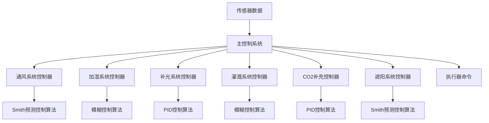
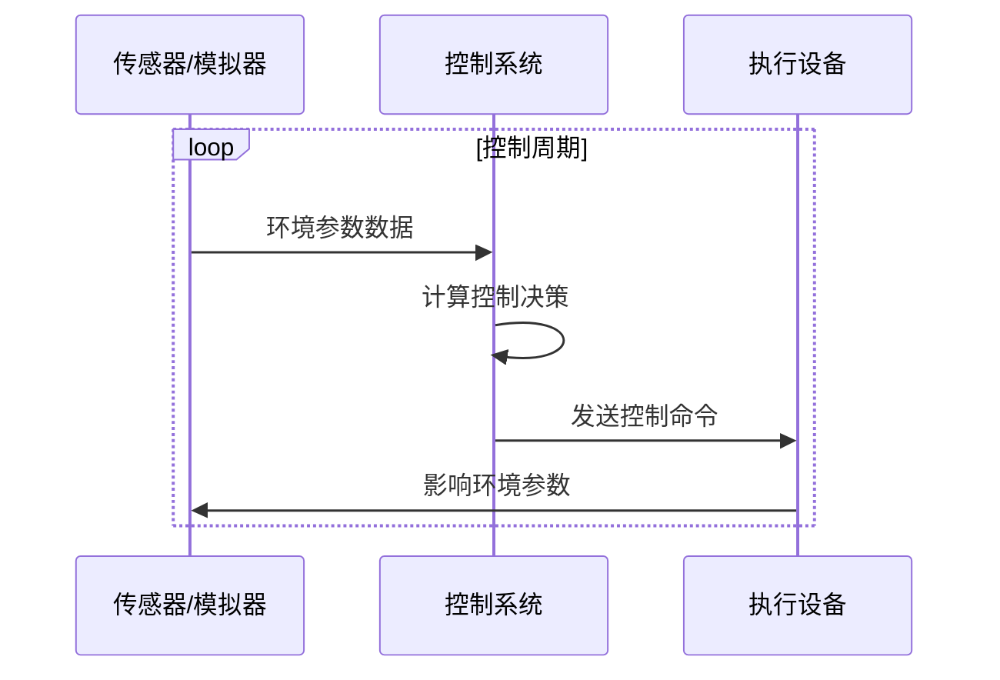
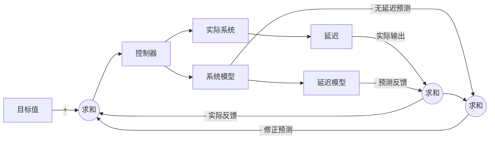
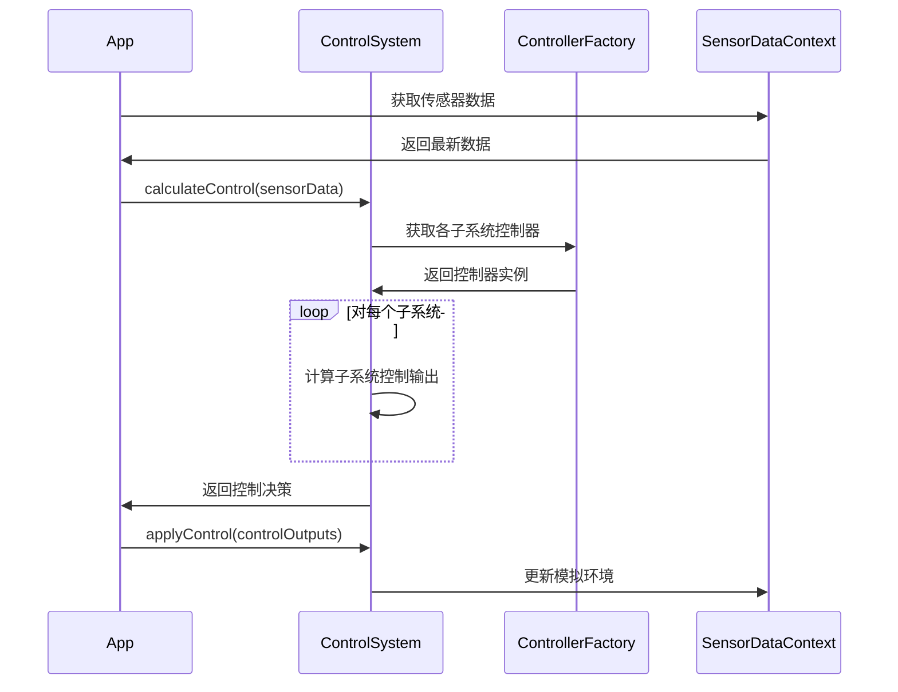

# 2.1 控制系统设计

[← 返回文档首页](../README.md)

## 目录导航

- [2.1.1 控制系统架构](#211-控制系统架构)
- [2.1.2 先进控制算法](#212-先进控制算法)
  - [2.1.2.1 PID控制](#2121-pid控制)
  - [2.1.2.2 模糊控制](#2122-模糊控制)
  - [2.1.2.3 Smith预测控制](#2123-smith预测控制)
- [2.1.3 控制算法应用](#213-控制算法应用)
- [2.1.4 子系统控制实现](#214-子系统控制实现)
  - [2.1.4.1 通风系统控制](#2141-通风系统控制)
  - [2.1.4.2 加湿系统控制](#2142-加湿系统控制)
  - [2.1.4.3 补光系统控制](#2143-补光系统控制)
- [2.1.5 控制系统集成](#215-控制系统集成)

## 相关文档
- [系统概述](../overview/system-overview.md)
- [数据生成与仿真](../simulation/data-generation-simulation.md)

---

本章节详细介绍智慧农业大棚控制系统采用的三种先进控制算法及其应用，为系统提供精确、稳定的环境控制能力。

## 2.1.1 控制系统架构

智慧农业大棚控制系统采用分层架构设计，针对不同环境参数的特性，集成多种专用控制算法。



控制系统的基本工作流程遵循"感知-决策-执行"模式：



## 2.1.2 先进控制算法

根据不同控制对象的特性，系统采用了三种主要的控制算法，每种算法针对特定的控制场景进行优化。

### 2.1.2.1 PID控制

PID（比例-积分-微分）控制是一种经典的反馈控制算法，适用于线性系统。

#### 数学原理

PID控制器根据误差的比例值、积分值和微分值计算控制量：

$$u(t) = K_p e(t) + K_i \int_{0}^{t} e(\tau) d\tau + K_d \frac{de(t)}{dt}$$

其中：
- $u(t)$ 是控制输出
- $e(t)$ 是误差信号（目标值与当前值的差）
- $K_p$、$K_i$、$K_d$ 分别是比例、积分、微分系数

#### 优势与适用场景

**主要优势**：
- 结构简单，易于实现和调整
- 不需要系统精确数学模型
- 控制稳定性好
- 在线性系统中有优秀表现

**适用子系统**：
- **补光系统**：光照强度与控制输出呈线性关系
- **CO2补充系统**：CO2浓度变化相对线性且响应较快

#### 实现方式

```typescript
class PIDController implements Controller {
  private kp: number; // 比例系数
  private ki: number; // 积分系数
  private kd: number; // 微分系数
  private integralSum: number = 0;
  private lastError: number = 0;
  private lastTime: number = 0;
  
  constructor(kp: number, ki: number, kd: number) {
    this.kp = kp;
    this.ki = ki;
    this.kd = kd;
  }
  
  calculate(setpoint: number, current: number): number {
    const now = Date.now();
    const error = setpoint - current;
    
    // 计算时间差
    const dt = this.lastTime === 0 ? 1 : (now - this.lastTime) / 1000;
    this.lastTime = now;
    
    // 计算积分项
    this.integralSum += error * dt;
    
    // 计算微分项
    const derivative = dt > 0 ? (error - this.lastError) / dt : 0;
    this.lastError = error;
    
    // 计算PID输出
    const output = this.kp * error + this.ki * this.integralSum + this.kd * derivative;
    
    // 限制输出范围在0-100%之间
    return Math.max(0, Math.min(100, output));
  }
  
  reset(): void {
    this.integralSum = 0;
    this.lastError = 0;
    this.lastTime = 0;
  }
}
```

### 2.1.2.2 模糊控制

模糊控制是一种基于模糊逻辑的控制方法，特别适用于非线性系统和难以精确建模的复杂系统。

#### 基本原理

模糊控制通过以下步骤实现：

1. **模糊化**：将精确输入（如温度误差）转换为模糊集（如"很冷"、"稍冷"、"适中"等）
2. **推理**：使用IF-THEN规则进行推理（如"如果温度很冷且变化缓慢，则加热功率很大"）
3. **去模糊化**：将模糊输出转换为精确控制值

#### 优势与适用场景

**主要优势**：
- 能够处理非线性系统和不确定性
- 不需要精确的数学模型
- 控制策略接近人类专家决策思路
- 自适应性强，易于调整

**适用子系统**：
- **加湿系统**：湿度控制具有非线性特性，受多因素影响
- **灌溉系统**：土壤湿度控制受环境、蒸发、植物吸收等多因素复杂影响

#### 实现方式

```typescript
class FuzzyController implements Controller {
  // 模糊规则示例：IF (error is large) AND (errorChange is small) THEN (output is veryLarge)
  private rules: FuzzyRule[] = [];
  
  constructor() {
    this.initRules();
  }
  
  // 模糊规则初始化
  private initRules(): void {
    // 例如: 如果误差很大且误差变化很小，则输出很大
    this.rules.push({
      errorMembership: 'veryLarge',
      errorChangeMembership: 'small',
      outputMembership: 'veryLarge'
    });
    
    // 更多规则...
  }
  
  // 计算控制输出
  calculate(error: number, errorChange: number): number {
    // 步骤1: 模糊化 - 计算输入的隶属度
    const errorMemberships = this.getErrorMembership(error);
    const errorChangeMemberships = this.getErrorChangeMembership(errorChange);
    
    // 步骤2: 模糊推理 - 应用规则
    const outputMemberships = this.applyRules(errorMemberships, errorChangeMemberships);
    
    // 步骤3: 去模糊化 - 计算精确输出
    const output = this.defuzzify(outputMemberships);
    
    // 限制输出范围
    return Math.max(0, Math.min(100, output));
  }
  
  // 其他辅助方法...
}
```

### 2.1.2.3 Smith预测控制

Smith预测控制是专为大延迟系统设计的控制方法，通过在控制器中加入系统内部模型来预测系统响应，有效补偿延迟影响。

#### 工作原理

Smith预测控制器包含以下关键部分：
- 常规控制器（通常是PID控制器）
- 系统模型（无延迟）
- 延迟模型

控制器工作流程：
1. 基于当前误差计算控制量
2. 使用系统模型预测无延迟响应
3. 使用延迟模型预测延迟响应
4. 修正反馈信号，补偿延迟影响



#### 优势与适用场景

**主要优势**：
- 有效处理系统中的大延迟问题
- 提高控制稳定性和响应速度
- 抑制系统波动和超调
- 适用于操作与效果间存在明显滞后的系统

**适用子系统**：
- **通风系统**：操作执行到温湿度变化之间存在明显延迟
- **遮阳系统**：遮阳操作与温度光照效果之间有较长响应延迟

#### 实现方式

```typescript
class SmithController implements Controller {
  private controller: PIDController; // 内部使用PID控制器
  private processModel: ProcessModel; // 系统模型
  private delayBuffer: number[]; // 延迟缓冲区
  private delaySteps: number; // 延迟步数
  
  constructor(kp: number, ki: number, kd: number, delayTime: number, sampleTime: number) {
    this.controller = new PIDController(kp, ki, kd);
    this.processModel = new ProcessModel();
    
    // 计算延迟步数
    this.delaySteps = Math.round(delayTime / sampleTime);
    this.delayBuffer = new Array(this.delaySteps).fill(0);
  }
  
  calculate(setpoint: number, measured: number): number {
    // 从系统模型获取无延迟预测
    const modelOutput = this.processModel.predict(this.delayBuffer[0]);
    
    // 修正反馈信号 = 测量值 - 延迟模型输出 + 无延迟模型输出
    const correctedFeedback = measured - this.delayBuffer[this.delaySteps - 1] + modelOutput;
    
    // 使用修正后的反馈计算控制量
    const controlOutput = this.controller.calculate(setpoint, correctedFeedback);
    
    // 更新延迟缓冲区
    this.delayBuffer.unshift(controlOutput);
    this.delayBuffer.pop();
    
    return controlOutput;
  }
}
```

## 2.1.3 控制算法应用

系统根据不同子系统的特性，选择最适合的控制算法进行环境参数调控：

| 子系统 | 控制算法 | 选择理由 | 关键参数 |
|-------|---------|---------|---------|
| 补光系统 | PID控制 | 线性特性明显，响应迅速 | 光照强度、日照时间 |
| 通风系统 | Smith预测控制 | 具有大延迟特性，需预测控制 | 温差、湿度差、风速 |
| 加湿系统 | 模糊控制 | 非线性特性明显，多因素影响 | 湿度偏差、温度 |
| 灌溉系统 | 模糊控制 | 多参数综合影响，存在不确定性 | 土壤湿度、蒸发率 |
| CO2系统 | PID控制 | 浓度变化较为线性，可精确控制 | CO2浓度、光照强度 |
| 遮阳系统 | Smith预测控制 | 操作与效果之间存在延迟 | 光照强度、温度趋势 |

## 2.1.4 子系统控制实现

以下是各环境控制子系统的具体实现方式：

### 2.1.4.1 通风系统控制

通风系统使用Smith预测控制器，负责调节大棚内的温度、湿度和空气流通。

```typescript
calculateVentilationControl(sensorData: SensorData): SystemOutput {
  const controller = this.controllers.get('ventilation');
  
  // 计算温度误差（归一化）
  const tempError = (sensorData.airTemperature - environmentConfig.airTemperature.target) /
    (environmentConfig.airTemperature.warningThreshold - environmentConfig.airTemperature.target);
  
  // 计算湿度误差（归一化）
  const humidityError = (sensorData.airHumidity - environmentConfig.airHumidity.target) /
    (environmentConfig.airHumidity.warningThreshold - environmentConfig.airHumidity.target);
  
  // 使用较大的误差作为控制输入
  const error = Math.max(tempError, humidityError) * 100;
  
  // 考虑外部风速因素
  const windFactor = sensorData.windSpeed ? Math.min(1, sensorData.windSpeed / 10) : 0.5;
  
  // 计算通风功率
  const power = controller.calculate(0, error) * windFactor;
  
  return {
    power,
    status: this.getVentilationStatus(sensorData),
    controlMode: 'smith'
  };
}
```

### 2.1.4.2 加湿系统控制

加湿系统使用模糊控制器，处理空气湿度的非线性调节。

```typescript
calculateHumidificationControl(sensorData: SensorData): SystemOutput {
  const controller = this.controllers.get('humidification');
  
  // 计算湿度误差
  const error = environmentConfig.airHumidity.target - sensorData.airHumidity;
  
  // 计算误差变化率
  const errorChange = this.getErrorChange('humidification', error);
  
  // 使用模糊控制器计算输出
  const power = controller.calculate(error, errorChange);
  
  // 根据温度调整加湿效率
  const tempFactor = Math.min(1.2, Math.max(0.8, sensorData.airTemperature / 25));
  const adjustedPower = power * tempFactor;
  
  return {
    power: adjustedPower,
    status: this.getHumidificationStatus(sensorData),
    controlMode: 'fuzzy'
  };
}
```

### 2.1.4.3 补光系统控制

补光系统使用PID控制器，在自然光不足时提供作物所需的光照。

```typescript
calculateLightingControl(sensorData: SensorData): SystemOutput {
  const controller = this.controllers.get('lighting');
  
  // 获取当前小时
  const hour = new Date().getHours();
  
  // 确定是否在光照期
  const isLightingPeriod = hour >= 5 && hour <= 21; // 5:00 - 21:00需要光照
  
  if (!isLightingPeriod) {
    // 非光照期，关闭补光
    return {
      power: 0,
      status: '待机 - 夜间休眠期',
      controlMode: 'pid'
    };
  }
  
  // 计算光照误差
  const error = environmentConfig.lightIntensity.target - sensorData.lightIntensity;
  
  // 只在光照不足时补光
  const power = error > 0 ? controller.calculate(environmentConfig.lightIntensity.target, sensorData.lightIntensity) : 0;
  
  return {
    power,
    status: this.getLightingStatus(sensorData),
    controlMode: 'pid'
  };
}
```

## 2.1.5 控制系统集成

系统将各子系统控制器集成到统一的控制框架中，实现协调控制：



通过这种集成方式，系统能够根据不同环境参数的特性，选择最适合的控制算法，实现精确、稳定的环境控制。 