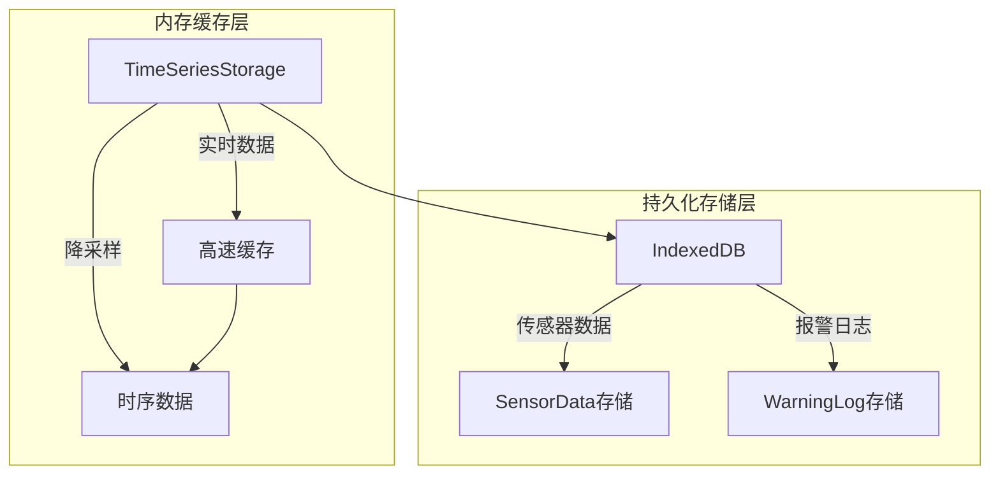
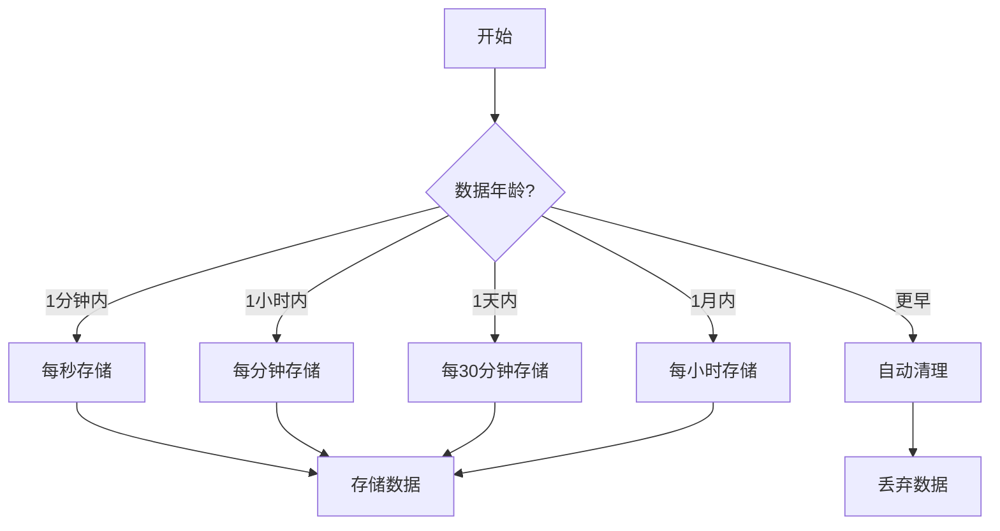
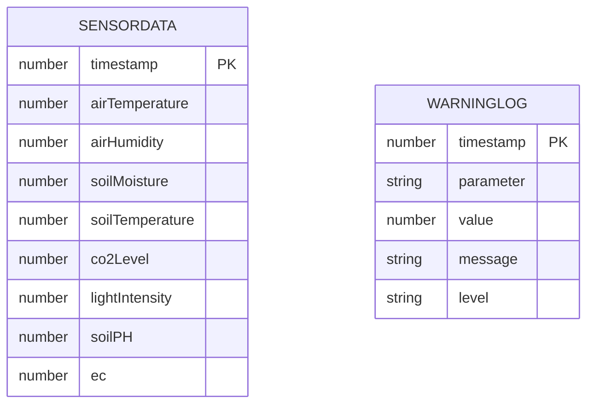
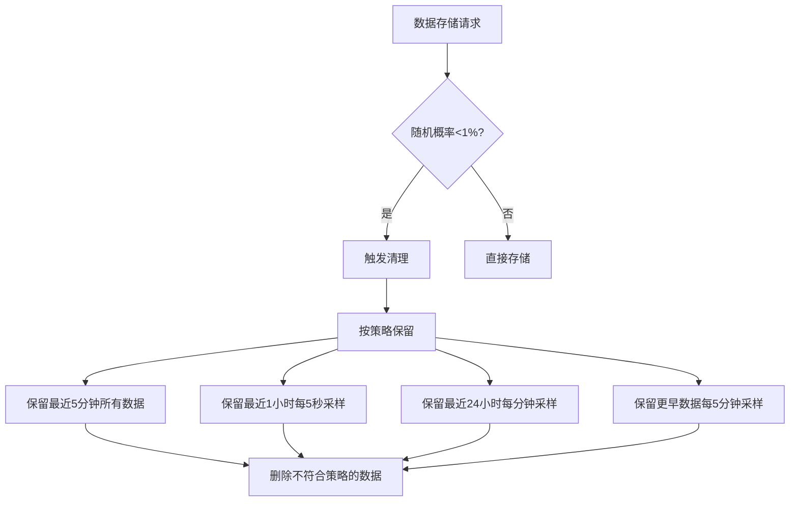

# 数据存储机制设计与实现

## 一、存储机制设计

### 1.1 存储架构设计

智能温室环境控制系统采用双层数据存储架构，结合内存缓存和持久化存储，实现高效的数据处理与查询：



1. **内存缓存层**：由 `TimeSeriesStorage` 类实现，负责实时数据的高速缓存和降采样。
2. **持久化存储层**：由 IndexedDB 实现，负责长期数据存储和历史数据查询。

### 1.2 数据采样策略设计

系统基于数据的时间范围，采用不同的采样间隔进行存储，实现时间粒度的动态调整：



### 1.3 数据库结构设计

系统使用 IndexedDB 进行持久化存储，主要包含两个对象存储：

1. **传感器数据存储 (sensorData)**：存储环境参数数据
2. **报警日志存储 (warningLogs)**：存储系统报警信息



### 1.4 数据清理策略设计

系统结合定期清理和概率触发清理机制，保证数据库大小在合理范围内：



## 二、存储机制实现

### 2.1 时序数据内存缓存实现

#### 2.1.1 单例模式实现

**文件位置**：`src/services/TimeSeriesStorage.ts`

```typescript
class TimeSeriesStorage {
  private static instance: TimeSeriesStorage;
  private data: Map<number, SensorData>;
  private maxSize: number = 100 * 1024 * 1024; // 100MB

  private constructor() {
    this.data = new Map();
  }

  public static getInstance(): TimeSeriesStorage {
    if (!TimeSeriesStorage.instance) {
      TimeSeriesStorage.instance = new TimeSeriesStorage();
    }
    return TimeSeriesStorage.instance;
  }
}
```

#### 2.1.2 存储判断算法实现

```typescript
private shouldStore(timestamp: number): boolean {
  const currentTime = Date.now();
  const age = currentTime - timestamp;

  // 1分钟内：每秒存储
  if (age <= 60 * 1000) return true;
  // 1小时内：每分钟存储
  if (age <= 60 * 60 * 1000) return timestamp % (60 * 1000) === 0;
  // 1天内：每30分钟存储
  if (age <= 24 * 60 * 60 * 1000) return timestamp % (30 * 60 * 1000) === 0;
  // 1月内：每小时存储
  if (age <= 30 * 24 * 60 * 60 * 1000) return timestamp % (60 * 60 * 1000) === 0;

  return false;
}
```

#### 2.1.3 存储大小控制实现

```typescript
private maintainDatabaseSize(): void {
  const currentSize = this.calculateDatabaseSize();
  if (currentSize > this.maxSize) {
    // 删除最旧的数据，直到大小低于限制
    const sortedTimestamps = Array.from(this.data.keys()).sort();
    while (this.calculateDatabaseSize() > this.maxSize && sortedTimestamps.length > 0) {
      const oldestTimestamp = sortedTimestamps.shift();
      if (oldestTimestamp) {
        this.data.delete(oldestTimestamp);
      }
    }
  }
}
```

### 2.2 IndexedDB 持久化存储实现

#### 2.2.1 数据库初始化

**文件位置**：`src/services/db.ts`

```typescript
interface FarmDB extends DBSchema {
  sensorData: {
    key: number;
    value: SensorData;
    indexes: {
      'by-timestamp': number;
    };
  };
  warningLogs: {
    key: number;
    value: WarningLog;
    indexes: {
      'by-timestamp': number;
    };
  };
}

let dbPromise: Promise<IDBPDatabase<FarmDB>>;

const initDB = async () => {
  if (!dbPromise) {
    dbPromise = openDB<FarmDB>('farm-db', 1, {
      upgrade(db) {
        const sensorStore = db.createObjectStore('sensorData', {
          keyPath: 'timestamp',
        });
        sensorStore.createIndex('by-timestamp', 'timestamp');

        const warningStore = db.createObjectStore('warningLogs', {
          keyPath: 'timestamp',
        });
        warningStore.createIndex('by-timestamp', 'timestamp');
      },
    });
  }
  return dbPromise;
};
```

#### 2.2.2 数据保留策略实现

```typescript
const RETENTION_POLICIES = {
  LAST_5_MIN: 5 * 60 * 1000,    // 保留最近5分钟的所有数据
  LAST_HOUR: 60 * 60 * 1000,    // 最近1小时每5秒保留一个数据点
  LAST_24_HOURS: 24 * 60 * 60 * 1000,  // 最近24小时每分钟保留一个数据点
  OLDER: Infinity,              // 更早的数据每5分钟保留一个数据点
};

const SAMPLING_INTERVALS = {
  LAST_HOUR: 5000,             // 5秒
  LAST_24_HOURS: 60000,        // 1分钟
  OLDER: 300000,               // 5分钟
};
```

#### 2.2.3 数据清理机制实现

数据清理算法伪代码：

```
Function cleanupOldData():
    db = await initDB()
    now = getCurrentTime()
    for each storeName in ['sensorData', 'warningLogs']:
        tx = db.transaction(storeName, 'readwrite')
        store = tx.store
        index = store.index('by-timestamp')
        
        cursor = await index.openCursor()
        toDelete = []
        
        while cursor:
            age = now - cursor.value.timestamp
            shouldDelete = false
            
            if age ≤ LAST_5_MIN:
                shouldDelete = false
            else if age ≤ LAST_HOUR:
                shouldDelete = cursor.value.timestamp % LAST_HOUR_INTERVAL ≠ 0
            else if age ≤ LAST_24_HOURS:
                shouldDelete = cursor.value.timestamp % LAST_24_HOURS_INTERVAL ≠ 0
            else:
                shouldDelete = cursor.value.timestamp % OLDER_INTERVAL ≠ 0
            
            if shouldDelete:
                toDelete.append(cursor.value.timestamp)
            
            cursor = await cursor.continue()
        
        for each key in toDelete:
            await store.delete(key)
        
        await tx.done
```

完整实现：

```typescript
// 清理旧数据
const cleanupOldData = async () => {
  const db = await initDB();
  const now = Date.now();
  const stores = ['sensorData', 'warningLogs'] as const;

  for (const storeName of stores) {
    const tx = db.transaction(storeName, 'readwrite');
    const store = tx.store;
    const index = store.index('by-timestamp');
    
    // 获取所有记录
    let cursor = await index.openCursor();
    const toDelete: number[] = [];
    
    while (cursor) {
      const age = now - cursor.value.timestamp;
      let shouldDelete = false;
      
      if (age <= RETENTION_POLICIES.LAST_5_MIN) {
        // 保留最近5分钟的所有数据
        shouldDelete = false;
      } else if (age <= RETENTION_POLICIES.LAST_HOUR) {
        // 最近1小时每5秒保留一个数据点
        shouldDelete = cursor.value.timestamp % SAMPLING_INTERVALS.LAST_HOUR !== 0;
      } else if (age <= RETENTION_POLICIES.LAST_24_HOURS) {
        // 最近24小时每分钟保留一个数据点
        shouldDelete = cursor.value.timestamp % SAMPLING_INTERVALS.LAST_24_HOURS !== 0;
      } else {
        // 更早的数据每5分钟保留一个数据点
        shouldDelete = cursor.value.timestamp % SAMPLING_INTERVALS.OLDER !== 0;
      }
      
      if (shouldDelete) {
        toDelete.push(cursor.value.timestamp);
      }
      
      cursor = await cursor.continue();
    }
    
    // 删除过滤的记录
    for (const key of toDelete) {
      await store.delete(key);
    }
    
    await tx.done;
  }
};
```

#### 2.2.4 概率触发清理实现

```typescript
export const saveSensorData = async (data: SensorData): Promise<void> => {
  const db = await initDB();
  await db.put('sensorData', data);
  
  // 每100次保存触发一次清理
  if (Math.random() < 0.01) {
    await cleanupOldData();
  }
};
```

### 2.3 数据查询接口实现

#### 2.3.1 获取指定时间范围数据

```typescript
export const getSensorDataInTimeRange = async (startTime: number, endTime: number): Promise<SensorData[]> => {
  const db = await initDB();
  const tx = db.transaction('sensorData', 'readonly');
  const index = tx.store.index('by-timestamp');
  const range = IDBKeyRange.bound(startTime, endTime);
  
  const data = await index.getAll(range);
  await tx.done;
  
  return data.sort((a, b) => a.timestamp - b.timestamp);
};
```

#### 2.3.2 获取最新数据

```typescript
export const getLatestSensorData = async (timeRange: number = 300000): Promise<SensorData[]> => {
  const db = await initDB();
  const now = Date.now();
  const tx = db.transaction('sensorData', 'readonly');
  const index = tx.store.index('by-timestamp');
  
  const data = await index.getAll(IDBKeyRange.lowerBound(now - timeRange));
  await tx.done;
  
  return data.sort((a, b) => a.timestamp - b.timestamp);
};
```

### 2.4 数据库大小估算实现

```typescript
export const getDBSize = async () => {
  const db = await initDB();
  const stores = ['sensorData', 'warningLogs'] as const;
  let totalSize = 0;
  
  for (const storeName of stores) {
    const tx = db.transaction(storeName, 'readonly');
    const store = tx.store;
    let cursor = await store.openCursor();
    
    while (cursor) {
      totalSize += JSON.stringify(cursor.value).length;
      cursor = await cursor.continue();
    }
    
    await tx.done;
  }
  
  return totalSize;
};
```

### 2.5 数据模拟生成实现

系统提供数据模拟生成功能，方便在没有实际传感器数据的情况下进行测试和演示：

```typescript
// 生成模拟传感器数据
const generateSensorData = (): SensorData => {
  return {
    timestamp: Date.now(),
    airTemperature: Number((20 + Math.random() * 10).toFixed(2)),  // 20-30℃
    airHumidity: Number((60 + Math.random() * 20).toFixed(2)),     // 60-80%
    soilMoisture: Number((70 + Math.random() * 15).toFixed(2)),    // 70-85%
    soilTemperature: Number((18 + Math.random() * 8).toFixed(2)),  // 18-26℃
    co2Level: Number((400 + Math.random() * 200).toFixed(2)),      // 400-600ppm
    lightIntensity: Number((2000 + Math.random() * 1000).toFixed(2)), // 2000-3000lux
    soilPH: Number((6.5 + Math.random()).toFixed(2)),              // 6.5-7.5
    ec: Number((1.2 + Math.random() * 0.5).toFixed(2)),            // 1.2-1.7 mS/cm
  };
};
``` 