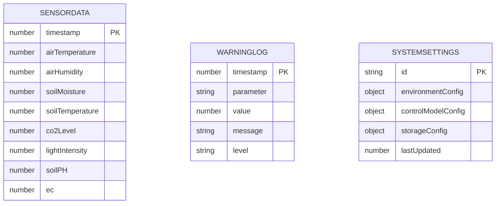
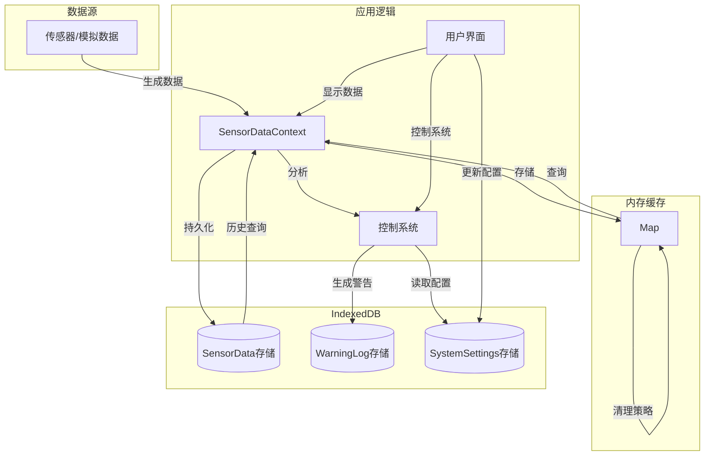
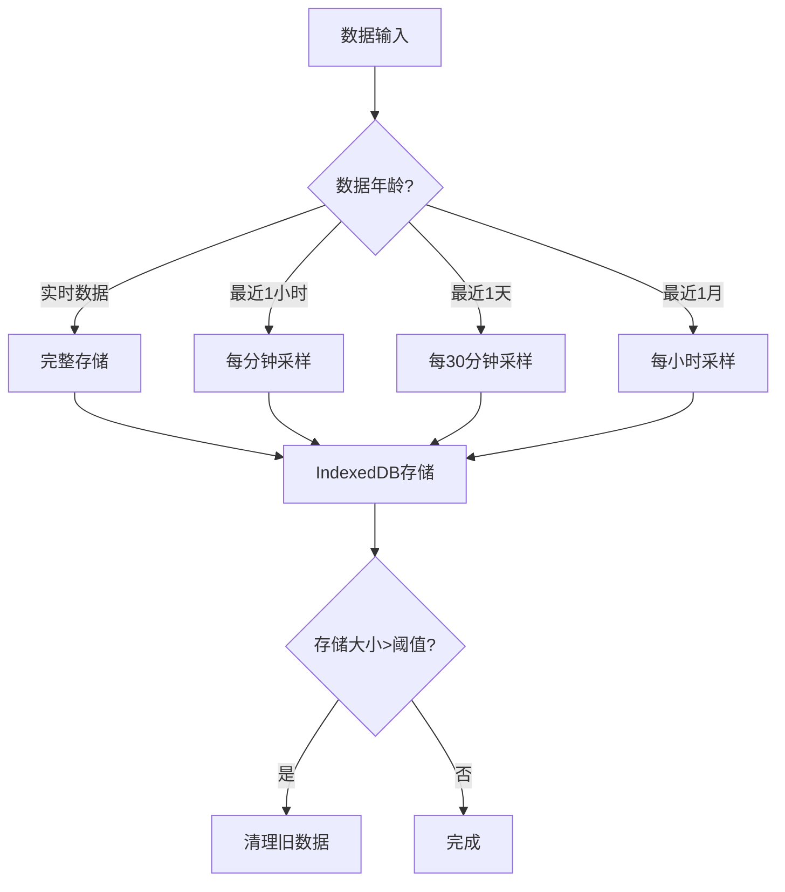

# 自然生态智慧农业大棚控制系统数据库 ER 图

本文档提供了系统使用的数据库实体关系图(ER Diagram)，描述数据库结构和关系。

## 1. 数据库概览

系统主要使用浏览器的 IndexedDB 进行数据持久化存储，结合内存缓存（Map 结构）实现高效的数据管理策略。

## 2. 主要实体关系图

## 3. 数据流转关系

## 4. 数据库具体结构

### 4.1 SensorData 存储结构

传感器数据是系统的核心数据实体，被用于实时监控、历史查询和控制决策。

| 字段名          | 类型   | 说明           | 单位  |
| --------------- | ------ | -------------- | ----- |
| timestamp       | number | 数据时间戳(PK) | 毫秒  |
| airTemperature  | number | 空气温度       | °C   |
| airHumidity     | number | 空气湿度       | %     |
| soilMoisture    | number | 土壤湿度       | %     |
| soilTemperature | number | 土壤温度       | °C   |
| co2Level        | number | CO2浓度        | ppm   |
| lightIntensity  | number | 光照强度       | lux   |
| soilPH          | number | 土壤pH值       | pH    |
| ec              | number | 电导率         | mS/cm |

### 4.2 WarningLog 存储结构

系统警告日志记录所有异常情况和报警信息，用于系统监控和问题诊断。

| 字段名    | 类型   | 说明                                  |
| --------- | ------ | ------------------------------------- |
| timestamp | number | 报警时间戳(PK)                        |
| parameter | string | 参数名称(如"airTemperature")          |
| value     | number | 触发警告的参数值                      |
| message   | string | 警告信息                              |
| level     | string | 警告级别("info"/"warning"/"critical") |

### 4.3 SystemSettings 存储结构

系统设置存储控制参数和各种配置信息，供系统运行时使用。

| 字段名             | 类型   | 说明                            |
| ------------------ | ------ | ------------------------------- |
| id                 | string | 设置ID(PK)                      |
| environmentConfig  | object | 环境参数配置(温度/湿度等目标值) |
| controlModelConfig | object | 控制模型参数(PID/模糊/Smith)    |
| storageConfig      | object | 存储策略配置                    |
| lastUpdated        | number | 上次更新时间戳                  |

## 5. 数据采样与存储策略

系统实现了分层的数据采样和存储策略，在 `TimeSeriesStorage` 中管理：

