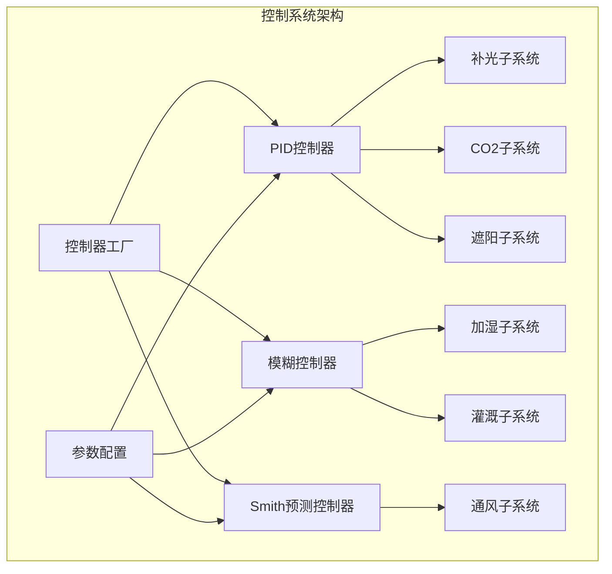
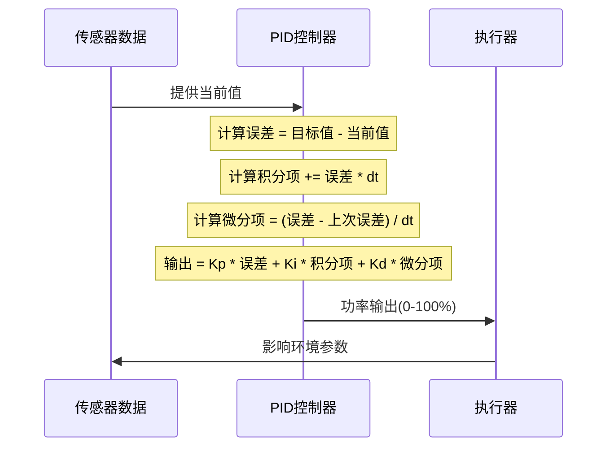
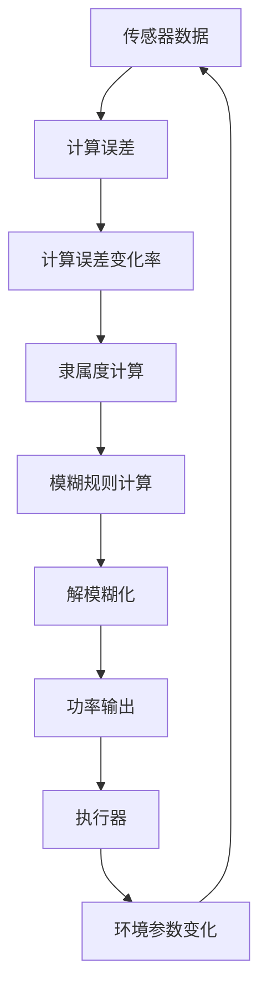
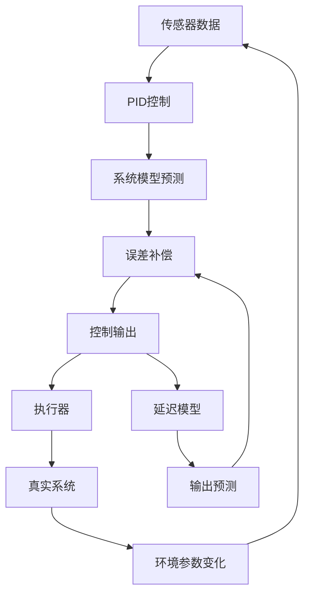
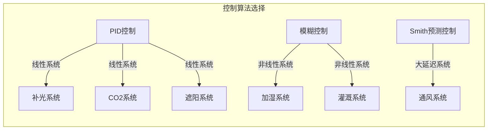
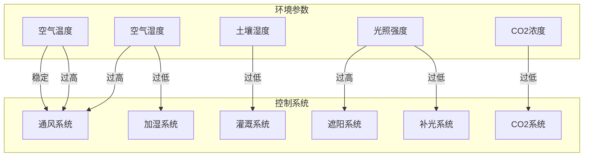
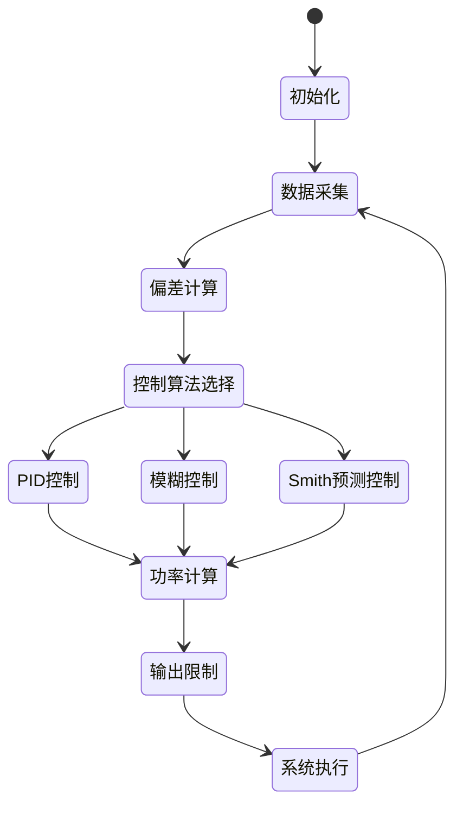
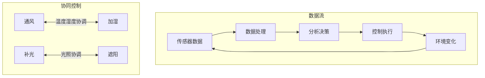

# 自然生态智慧农业大棚控制系统架构图

本文档集中展示了系统中的控制系统架构和工作流程图，帮助理解系统的控制逻辑。

## 1. 控制系统整体架构

## 2. PID控制器工作流程

## 3. 模糊控制器工作流程

## 4. Smith预测控制器工作流程

## 5. 子系统控制特性

## 6. 环境参数与控制系统关系

## 7. 控制决策流程

## 8. 控制系统协同工作

