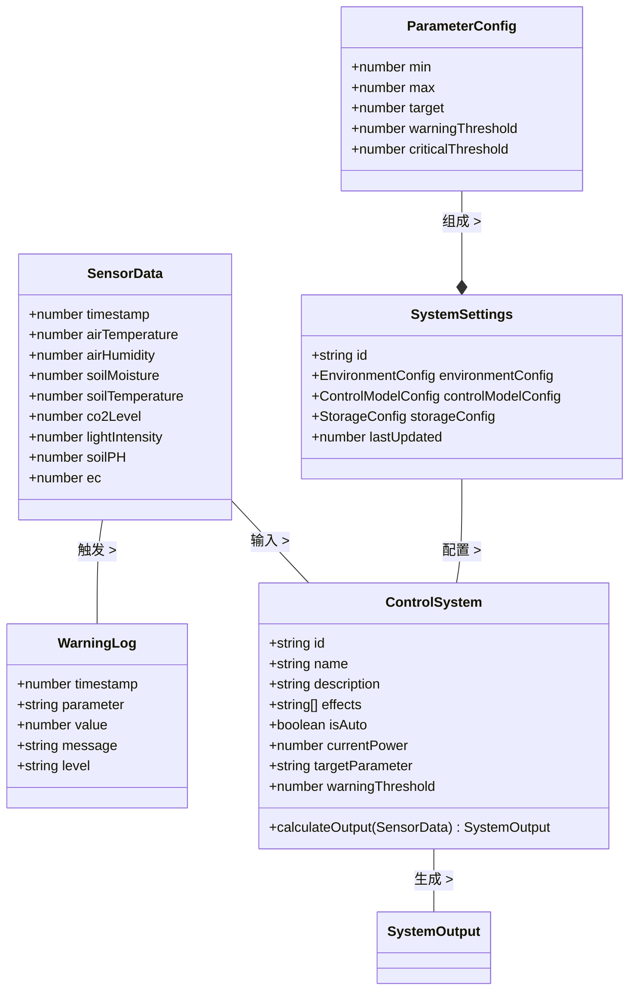
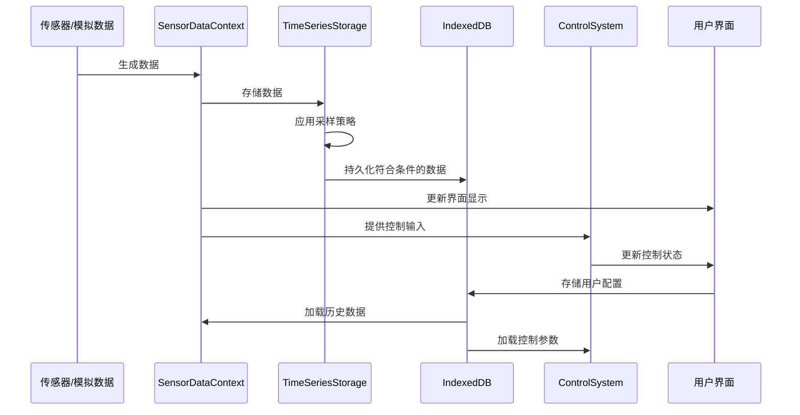

# 自然生态智慧农业大棚控制系统数据实体

本文档详细描述了系统中使用的各种数据实体和类型，这些实体构成了系统的数据基础。

## 1. 核心数据实体

### 1.1 SensorData (传感器数据)

传感器数据是系统的基础数据单元，记录了各种环境参数的实时状态。

```typescript
interface SensorData {
  timestamp: number;        // 数据时间戳
  airTemperature: number;   // 空气温度 (°C)
  airHumidity: number;      // 空气湿度 (%)
  soilMoisture: number;     // 土壤湿度 (%)
  soilTemperature: number;  // 土壤温度 (°C)
  co2Level: number;         // CO2浓度 (ppm)
  lightIntensity: number;   // 光照强度 (lux)
  soilPH: number;           // 土壤pH值
  ec: number;               // 电导率 (mS/cm)
}
```

### 1.2 WarningLog (警告日志)

警告日志记录系统中的异常或需要关注的状态，帮助用户监控系统运行情况。

```typescript
interface WarningLog {
  timestamp: number;        // 警告时间戳
  parameter: string;        // 相关参数名称
  value: number;            // 参数当前值
  message: string;          // 警告信息
  level: 'info' | 'warning' | 'critical'; // 警告级别
}
```

### 1.3 SystemSettings (系统设置)

系统设置存储了各种配置信息，包括环境参数目标值、控制算法参数等。

```typescript
interface SystemSettings {
  id: string;               // 设置ID
  environmentConfig: {      // 环境参数配置
    airTemperature: ParameterConfig;
    airHumidity: ParameterConfig;
    soilMoisture: ParameterConfig;
    soilTemperature: ParameterConfig;
    co2Level: ParameterConfig;
    lightIntensity: ParameterConfig;
  };
  controlModelConfig: {     // 控制模型配置
    pid: PIDConfig;
    fuzzy: FuzzyConfig;
    smith: SmithConfig;
  };
  storageConfig: {          // 存储配置
    maxSize: number;
    samplingIntervals: SamplingIntervals;
    retention: RetentionPolicy;
  };
  lastUpdated: number;      // 上次更新时间
}
```

## 2. 控制系统数据实体

### 2.1 ControlSystem (控制系统)

控制系统数据描述了各个环境控制子系统的状态和配置。

```typescript
interface ControlSystem {
  id: string;               // 系统ID
  name: string;             // 系统名称
  description: string;      // 系统描述
  effects: string[];        // 系统效果列表
  isAuto: boolean;          // 是否自动控制
  currentPower: number;     // 当前功率 (%)
  targetParameter: keyof SensorData; // 目标参数
  warningThreshold?: number; // 警告阈值
}
```

### 2.2 SystemOutput (系统输出)

系统输出描述控制系统的计算结果。

```typescript
interface SystemOutput {
  power: number;            // 输出功率 (%)
  status: string;           // 状态描述
  controlMode: 'pid' | 'fuzzy' | 'smith'; // 控制模式
}
```

## 3. 配置参数数据实体

### 3.1 ParameterConfig (参数配置)

环境参数配置定义了每个环境参数的工作范围和目标值。

```typescript
interface ParameterConfig {
  min: number;              // 最小允许值
  max: number;              // 最大允许值
  target: number;           // 目标值
  warningThreshold: number; // 警告阈值
  criticalThreshold?: number; // 临界阈值
}
```

### 3.2 PIDConfig (PID控制器配置)

PID控制器的参数设置。

```typescript
interface PIDConfig {
  defaultKp: number;        // 默认比例系数
  defaultKi: number;        // 默认积分系数
  defaultKd: number;        // 默认微分系数
  maxIntegral: number;      // 积分限幅值
}
```

### 3.3 FuzzyConfig (模糊控制器配置)

模糊控制器的参数设置。

```typescript
interface FuzzyConfig {
  membershipRanges: {
    error: number[];        // 误差隶属度范围
    errorChange: number[];  // 误差变化率隶属度范围
  };
  rules: number[][];        // 模糊规则矩阵
}
```

### 3.4 SmithConfig (Smith预测控制器配置)

Smith预测控制器的参数设置。

```typescript
interface SmithConfig {
  deadTime: number;         // 系统死区时间 (秒)
  timeConstant: number;     // 系统时间常数 (秒)
  modelGain: number;        // 模型增益
}
```

## 4. 存储相关数据实体

### 4.1 StorageStats (存储统计)

存储统计信息描述了当前数据存储状态。

```typescript
interface StorageStats {
  totalPoints: number;      // 数据点总数
  dbSize: number;           // 数据库大小 (字节)
  oldestData: number;       // 最早数据时间戳
  newestData: number;       // 最新数据时间戳
}
```

### 4.2 SamplingIntervals (采样间隔)

采样间隔定义了不同时间范围内的数据采样频率。

```typescript
interface SamplingIntervals {
  lastMinute: number;       // 最近1分钟的采样间隔 (秒)
  lastHour: number;         // 最近1小时的采样间隔 (秒)
  lastDay: number;          // 最近1天的采样间隔 (秒)
  lastMonth: number;        // 最近1个月的采样间隔 (秒)
}
```

### 4.3 RetentionPolicy (数据保留策略)

数据保留策略定义了不同类型数据的保留时间。

```typescript
interface RetentionPolicy {
  default: number;          // 默认保留时间 (毫秒)
  warningLogs: number;      // 警告日志保留时间 (毫秒)
}
```

## 5. 数据实体关系图



## 6. 数据通信模型

