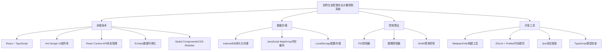
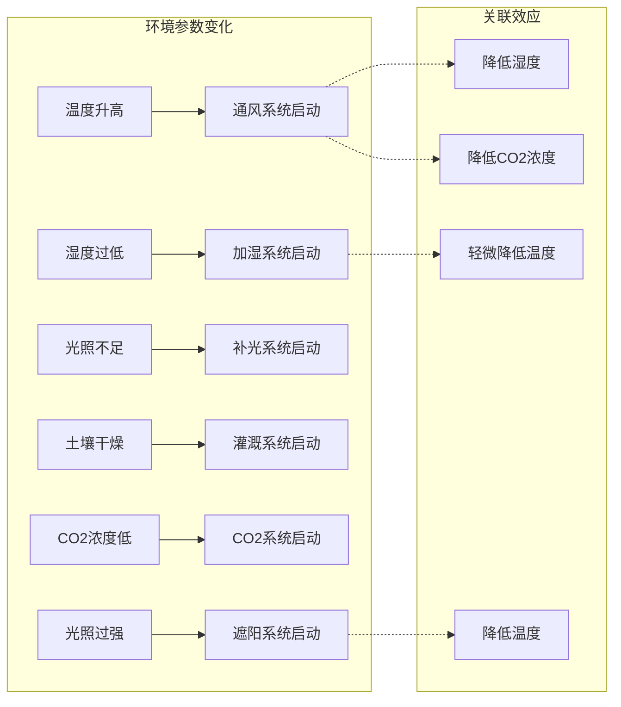
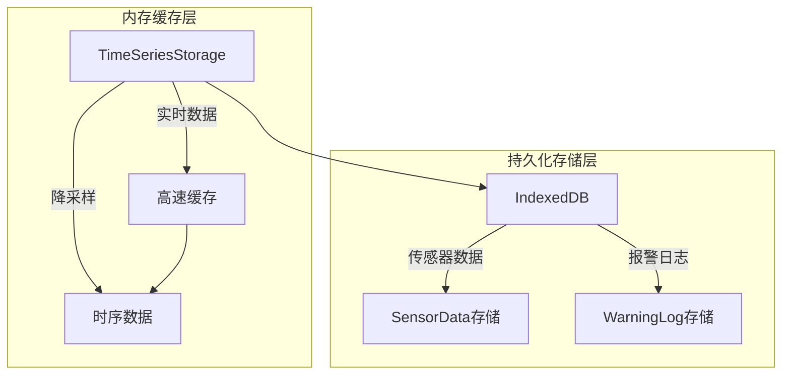
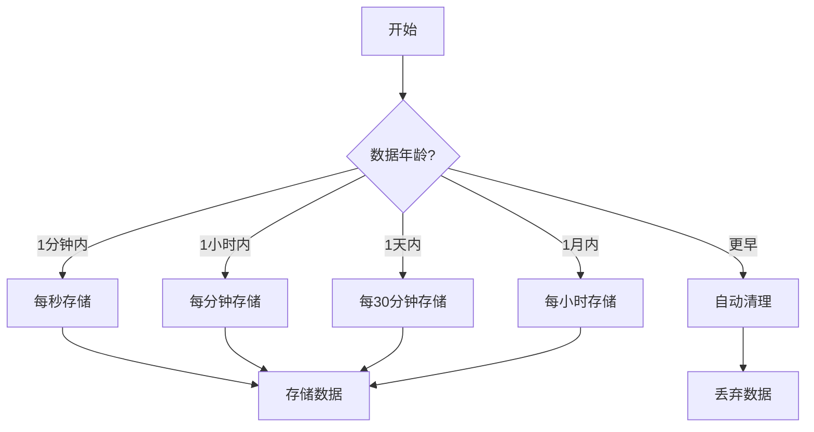
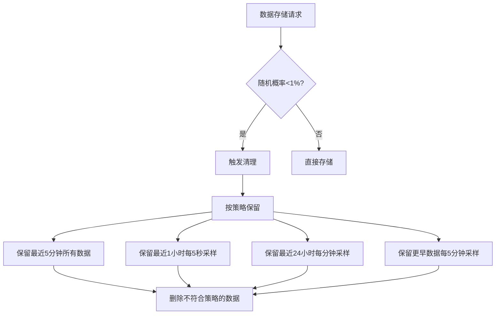

# 自然生态智慧农业大棚控制系统架构图集

本文档收集了项目中的各种系统架构图表，帮助开发者和用户了解系统的结构和工作原理。

## 1. 系统技术架构

```mermaid
graph TD
    A[自然生态智慧农业大棚控制系统] --> B[前端技术]
    A --> C[数据存储]
    A --> D[控制算法]
    A --> E[开发工具]
  
    B --> B1[React + TypeScript]
    B --> B2[Ant Design UI组件库]
    B --> B3[React Context API状态管理]
    B --> B4[Echarts数据可视化]
    B --> B5[Styled Components/CSS Modules]
  
    C --> C1[IndexedDB持久化存储]
    C --> C2[JavaScript Map/Array内存缓存]
    C --> C3[LocalStorage配置存储]
  
    D --> D1[PID控制器]
    D --> D2[模糊控制器]
    D --> D3[Smith预测控制]
  
    E --> E1[Webpack/Vite构建工具]
    E --> E2[ESLint + Prettier代码规范]
    E --> E3[Jest测试框架]
    E --> E4[TypeScript类型检查]
```

## 2. 控制系统响应特性

```mermaid
graph LR
    subgraph 环境参数变化
        P1[温度升高] --> R1[通风系统启动]
        P2[湿度过低] --> R2[加湿系统启动]
        P3[光照不足] --> R3[补光系统启动]
        P4[土壤干燥] --> R4[灌溉系统启动]
        P5[CO2浓度低] --> R5[CO2系统启动]
        P6[光照过强] --> R6[遮阳系统启动]
    end
  
    subgraph 关联效应

        R1 -.-> E1[降低湿度]
        R1 -.-> E2[降低CO2浓度]
        R2 -.-> E3[轻微降低温度]
        R6 -.-> E4[降低温度]
    end
```

## 3. 数据存储架构

```mermaid
flowchart TD
    subgraph MemoryCache["内存缓存层"]
        A[TimeSeriesStorage] --> |实时数据| B[高速缓存]
        A --> |降采样| C[时序数据]
    end
  
    subgraph PersistentStorage["持久化存储层"]
        D[IndexedDB] --> |传感器数据| E[SensorData存储]
        D --> |报警日志| F[WarningLog存储]
    end
  
    A --> D
    B --> C
```

## 4. 数据采样策略

```mermaid
graph TD
    Start[开始] --> Age{数据年龄?}
    Age -->|1分钟内| A[每秒存储]
    Age -->|1小时内| B[每分钟存储]
    Age -->|1天内| C[每30分钟存储]
    Age -->|1月内| D[每小时存储]
    Age -->|更早| E[自动清理]
  
    A --> Store[存储数据]
    B --> Store
    C --> Store
    D --> Store
    E --> Discard[丢弃数据]
```

## 5. 数据清理策略

```mermaid
flowchart TD
    A[数据存储请求] --> P{随机概率<1%?}
    P -->|是| C[触发清理]
    P -->|否| S[直接存储]
  
    C --> R[按策略保留]
    R --> L1[保留最近5分钟所有数据]
    R --> L2[保留最近1小时每5秒采样]
    R --> L3[保留最近24小时每分钟采样]
    R --> L4[保留更早数据每5分钟采样]
  
    L1 --> D[删除不符合策略的数据]
    L2 --> D
    L3 --> D
    L4 --> D
```
