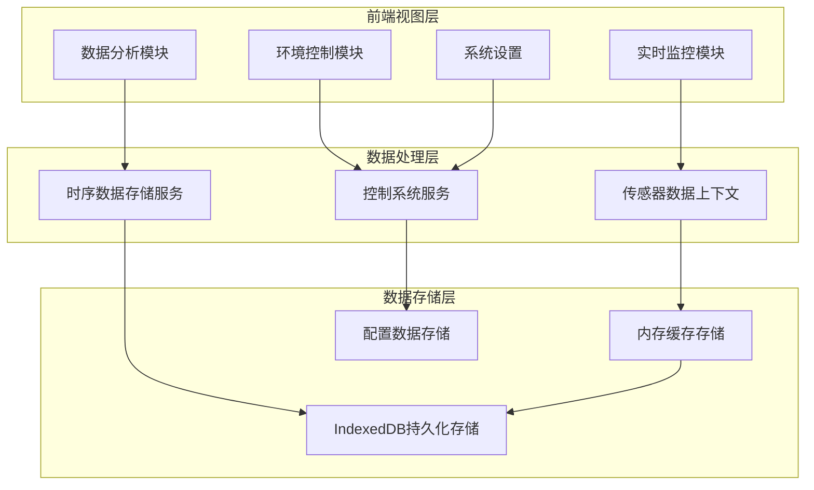
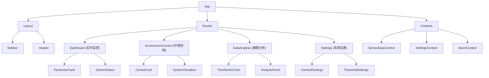
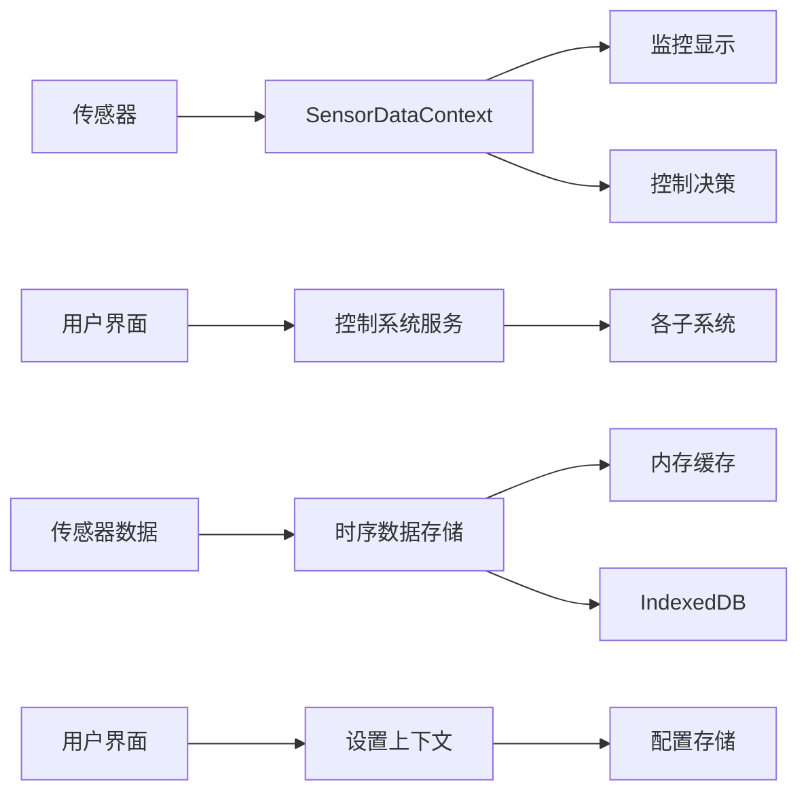
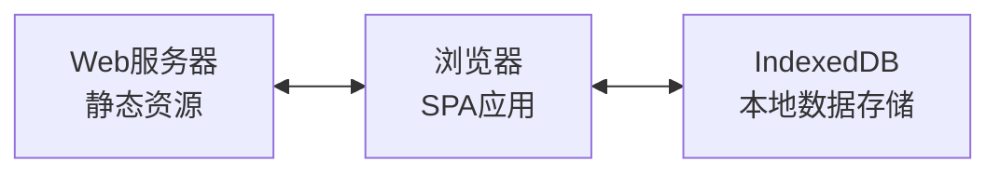

# 智能温室环境控制系统架构概览

## 一、系统设计

### 1.1 总体架构设计

智能温室环境控制系统采用分层架构设计，通过多个模块协同工作，实现智能化环境监控与控制：



### 1.2 系统功能模块设计

#### 1.2.1 前端视图层

用户界面包含四个主要部分：

1. **实时监控模块**：展示当前环境参数和系统状态
2. **环境控制模块**：提供各子系统的自动/手动控制
3. **数据分析模块**：提供历史数据查询和分析
4. **系统设置模块**：提供参数配置和系统维护

#### 1.2.2 数据处理层

数据处理层负责系统核心逻辑：

1. **传感器数据上下文**：负责数据生成、处理和分发
2. **控制系统服务**：实现各子系统的控制逻辑
3. **时序数据存储服务**：管理数据的存储和检索

#### 1.2.3 数据存储层

数据存储层实现数据持久化：

1. **内存缓存**：提供高速数据访问
2. **IndexedDB持久化存储**：提供数据长期保存
3. **配置数据存储**：保存系统配置参数

### 1.3 控制算法选型设计

系统根据不同子系统的特性选择合适的控制算法：

| 子系统 | 控制算法 | 选择理由 |
|-------|---------|---------|
| 通风系统 | Smith预测控制 | 系统具有大延迟特性 |
| 加湿系统 | 模糊控制 | 系统为非线性特性 |
| 补光系统 | PID控制 | 系统为线性特性，响应快速 |
| 灌溉系统 | 模糊控制 | 系统为非线性特性 |
| CO2系统 | PID控制 | 系统为线性特性 |
| 遮阳系统 | PID控制 | 系统为线性特性 |

### 1.4 数据存储策略设计

系统采用多级数据存储策略，平衡性能与存储空间：

| 数据年龄 | 存储间隔 | 存储位置 |
|---------|---------|---------|
| 1分钟内 | 每秒 | 内存 + IndexedDB |
| 1小时内 | 每分钟 | 内存 + IndexedDB |
| 1天内 | 每30分钟 | 内存 + IndexedDB |
| 1月内 | 每小时 | 仅IndexedDB |
| 更旧数据 | - | 自动清理 |

### 1.5 组件依赖设计



### 1.6 数据流设计

系统的数据流主要包含以下路径：



### 1.7 系统部署架构设计

系统设计为单页应用（SPA），部署架构如下：



## 二、系统实现

### 2.1 技术栈选择

#### 2.1.1 前端技术

- **框架**：React + TypeScript
- **UI组件**：Ant Design
- **状态管理**：React Context API
- **数据可视化**：Echarts
- **样式管理**：Styled Components / CSS Modules

#### 2.1.2 数据存储

- **内存缓存**：JavaScript Map/Array
- **持久化存储**：IndexedDB (通过idb库)
- **配置存储**：LocalStorage

#### 2.1.3 开发工具

- **构建工具**：Webpack / Vite
- **代码质量**：ESLint + Prettier
- **测试框架**：Jest + React Testing Library

### 2.2 状态管理实现

系统通过 React Context API 实现全局状态管理：

```typescript
// 传感器数据上下文
const SensorDataContext = createContext<SensorDataContextType>({
  sensorData: null,
  isLoading: true,
  error: null,
  getHistoricalData: () => [],
  getStorageStats: () => ({
    totalPoints: 0,
    dbSize: 0,
    oldestData: 0,
    newestData: 0,
  }),
  cleanupOldData: () => {},
});

// 系统设置上下文
const SettingsContext = createContext<SettingsContextType>({
  settings: defaultSettings,
  updateSettings: () => {},
  resetSettings: () => {},
});
```

### 2.3 关键算法伪代码

#### 2.3.1 数据采样与存储算法

```
Function shouldStore(timestamp):
    currentTime = getCurrentTime()
    age = currentTime - timestamp
    
    if age ≤ 60秒 then
        return true
    else if age ≤ 60分钟 then
        return timestamp % 60秒 == 0
    else if age ≤ 24小时 then
        return timestamp % 30分钟 == 0
    else if age ≤ 30天 then
        return timestamp % 60分钟 == 0
    else
        return false
```

#### 2.3.2 控制系统选择算法

```
Function selectController(subsystemType):
    switch subsystemType:
        case "ventilation":
            return new SmithPredictor()
        case "humidification":
        case "irrigation":
            return new FuzzyController()
        case "lighting":
        case "co2":
        case "shading":
            return new PIDController()
        default:
            throw "Unknown subsystem type"
```

### 2.4 部署注意事项

1. **离线支持**：系统支持离线运行，数据保存在本地
2. **兼容性**：支持现代浏览器，推荐Chrome 80+/Firefox 75+/Edge 80+
3. **响应式设计**：支持PC端和移动端访问

### 2.5 未来扩展实现

系统设计考虑了未来可能的扩展方向：

1. **远程监控**：添加服务器端组件，支持远程监控与控制
2. **多设备协同**：支持多设备数据同步与控制
3. **AI预测**：集成机器学习模型，预测环境变化和作物生长
4. **硬件接口**：添加实际硬件传感器和控制设备的接口

#### 2.5.1 扩展接口预留

```typescript
// 远程数据接口
interface RemoteDataService {
  fetchSensorData(): Promise<SensorData[]>;
  sendControlCommand(system: string, command: ControlCommand): Promise<void>;
  syncSettings(settings: SystemSettings): Promise<void>;
}

// AI预测接口
interface PredictionService {
  predictEnvironment(current: SensorData, hours: number): Promise<SensorData[]>;
  suggestOptimalSettings(plantType: string): Promise<Partial<SystemSettings>>;
}
```

## 三、技术文档导航

- [数据存储机制](./data-storage-mechanism.md)
- [控制系统架构](./control-system-architecture.md)
- [实时监控系统](./real-time-monitoring-system.md)
- [环境控制子系统](./environmental-control-subsystems.md) 