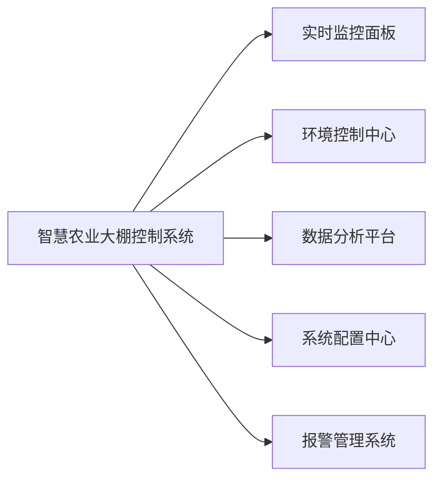
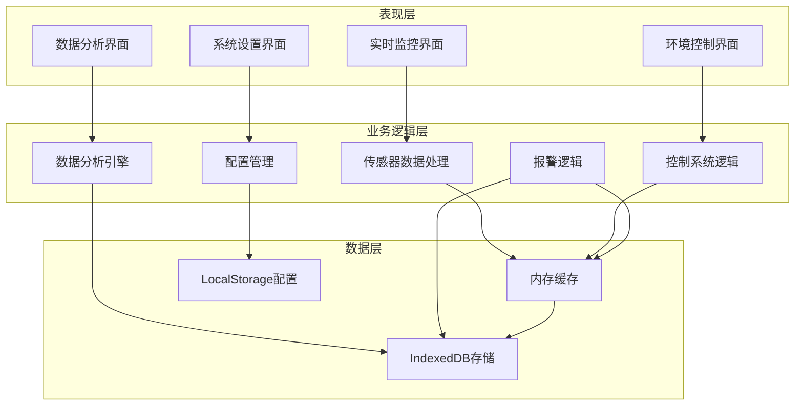
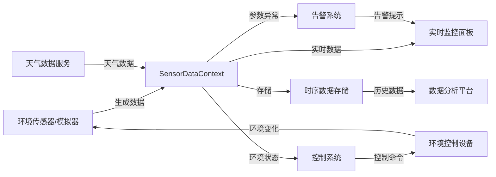
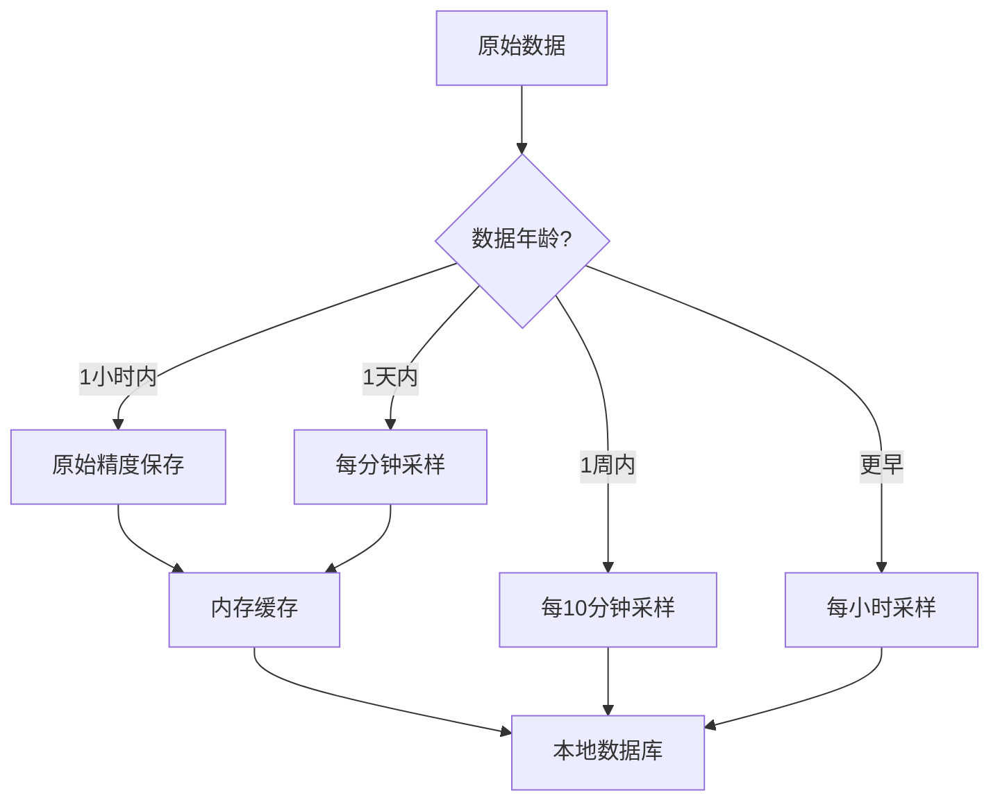

# 1. 系统概述

[← 返回文档首页](../README.md)

## 目录导航

- [1.1 系统功能](#11-系统功能)
  - [1.1.1 核心功能模块](#111-核心功能模块)
  - [1.1.2 系统应用场景](#112-系统应用场景)
- [1.2 系统架构](#12-系统架构)
  - [1.2.1 架构层次](#121-架构层次)
  - [1.2.2 核心组件](#122-核心组件)
  - [1.2.3 数据流](#123-数据流)
  - [1.2.4 控制算法选型](#124-控制算法选型)
  - [1.2.5 数据存储策略](#125-数据存储策略)
  - [1.2.6 系统部署架构](#126-系统部署架构)
- [1.3 技术栈](#13-技术栈)
  - [1.3.1 前端核心技术](#131-前端核心技术)
  - [1.3.2 数据处理与存储](#132-数据处理与存储)
  - [1.3.3 计算与算法](#133-计算与算法)
  - [1.3.4 开发工具](#134-开发工具)
  - [1.3.5 环境要求](#135-环境要求)

## 相关文档
- [控制系统设计](../design/control-system-design.md)
- [数据生成与仿真](../simulation/data-generation-simulation.md)
- [数据存储机制](../design/data-storage-mechanism.md)

---

## 1.1 系统功能

智慧农业大棚控制系统是一个专为现代精准农业设计的智能环境控制系统，通过实时监测和精确调控温室环境参数，为作物创造最佳生长条件，提高产量和质量。

### 1.1.1 核心功能模块

#### 实时监控面板

- **环境参数实时展示**：直观显示农业大棚内的温度、湿度、光照、CO2浓度等关键参数
- **设备状态监控**：实时显示各控制设备的工作状态、运行功率和运行时长
- **数据趋势可视化**：通过动态曲线图展示参数变化趋势
- **警报状态显示**：当环境参数超出安全范围时发出警报提示

#### 环境控制中心

- **多子系统管理**：集中管理通风、加湿、补光、灌溉、CO2补充、遮阳等子系统
- **自动/手动切换**：支持自动控制与手动操作的灵活切换
- **精细控制调节**：提供设备功率百分比的精确调节
- **控制状态反馈**：直观显示控制命令的执行结果和环境响应

#### 数据分析平台

- **历史数据查询**：支持按时间范围、参数类型查询历史数据
- **统计分析功能**：提供均值、最大值、最小值等统计分析
- **相关性分析**：分析不同环境参数之间的相关关系
- **趋势预测**：基于历史数据预测环境参数变化趋势

#### 系统配置中心

- **控制参数设置**：配置各子系统的控制参数和算法选择
- **警报阈值设置**：自定义环境参数的警报阈值范围
- **数据管理选项**：提供数据存储、备份和清理功能
- **系统性能优化**：提供系统运行参数的调优选项

#### 报警管理系统

- **实时警报提示**：当环境参数异常时立即发出警报
- **警报级别分类**：将警报按严重程度分级显示
- **处理建议生成**：针对警报情况提供处理建议
- **警报历史记录**：保存并可查询历史警报记录

### 1.1.2 系统应用场景

智慧农业大棚控制系统适用于多种现代农业场景：

1. **蔬菜温室大棚**：为番茄、黄瓜、辣椒等作物提供精准环境控制
2. **花卉种植基地**：满足各类花卉对环境条件的特殊需求
3. **育苗中心**：为幼苗生长提供稳定可控的环境条件
4. **植物工厂**：支持无土栽培和垂直农业的环境控制需求
5. **科研温室**：为农业科研提供精确的环境参数控制和数据记录

## 1.2 系统架构

智慧农业大棚控制系统采用分层架构设计，确保系统的可扩展性和可维护性。

### 1.2.1 架构层次

### 1.2.2 核心组件

系统由以下核心组件构成：

1. **SensorDataContext**：传感器数据上下文，管理所有环境参数数据的获取、处理和分发。
   
2. **ControlSystem**：控制系统服务，负责根据环境条件和目标参数计算控制输出，包含多种控制算法：
   - PID控制器：用于线性控制系统
   - 模糊控制器：用于非线性复杂系统
   - Smith预测控制器：用于含有大延迟的系统

3. **TimeSeriesStorage**：时序数据存储服务，负责环境数据的高效存储和查询。

4. **EnvironmentSimulation**：环境模拟服务，基于物理模型和天气数据生成真实的环境参数。

5. **WeatherDataService**：天气数据服务，获取实时或模拟的外部天气数据。

6. **AlarmService**：告警服务，监控环境参数，在异常时生成警报。

### 1.2.3 数据流

### 1.2.4 控制算法选型

系统根据不同控制对象的特性，选择了多种控制算法进行环境调控：

| 控制对象 | 算法选择      | 选择理由                               |
| -------- | ------------- | -------------------------------------- |
| 补光系统 | PID控制       | 线性特性明显，经典PID算法足以应对      |
| 通风系统 | Smith预测控制 | 具有大延迟特性，需要预测控制           |
| 加湿系统 | 模糊控制      | 非线性特性明显，模糊控制适应性更强     |
| 灌溉系统 | 模糊控制      | 多参数影响，存在不确定性，适合模糊控制 |
| CO2系统  | PID控制       | 浓度变化较为线性，PID控制稳定可靠      |
| 遮阳系统 | Smith预测控制 | 操作与效果之间存在延迟，需要预测控制   |

### 1.2.5 数据存储策略

系统采用多层数据存储策略，平衡性能和存储空间：

针对不同时间跨度的数据采用不同的存储精度，最近数据保留更高精度，历史数据进行降采样，平衡存储空间和查询性能。

### 1.2.6 系统部署架构

系统设计为单页应用（SPA），部署架构如下：

## 1.3 技术栈

系统采用现代前端技术栈开发，主要包括：

### 1.3.1 前端核心技术

- **框架**：React + TypeScript
- **状态管理**：React Context API
- **UI组件库**：Ant Design
- **数据可视化**：ECharts
- **样式管理**：Styled Components

### 1.3.2 数据处理与存储

- **客户端数据库**：IndexedDB (通过idb库封装)
- **缓存管理**：内存缓存 + LocalStorage
- **时间处理**：Day.js

### 1.3.3 计算与算法

- **控制算法**：PID控制、模糊控制、Smith预测控制
- **数据处理**：JavaScript数学库
- **模拟计算**：基于物理模型的环境参数计算

### 1.3.4 开发工具

- **构建工具**：Vite
- **代码质量**：ESLint + Prettier
- **版本控制**：Git
- **API模拟**：Mock.js / 自定义模拟服务

### 1.3.5 环境要求

- **推荐的运行环境**：
  - 现代浏览器（Chrome, Firefox, Safari, Edge）
  - 推荐分辨率：1920×1080或更高
  - 网络连接：本地运行，无需网络（天气数据模拟模式）
  - 存储空间：至少500MB可用空间（用于IndexedDB数据存储） 