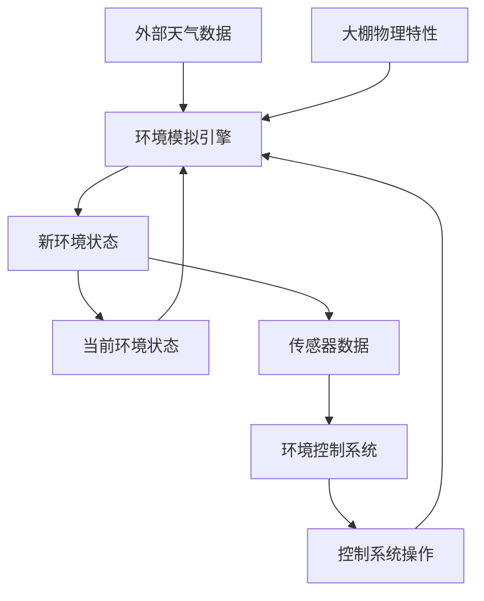

# 4. 数据生成与仿真

[← 返回文档首页](../README.md)

## 目录导航

- [4.1 传统数据生成模型](#41-传统数据生成模型)
  - [4.1.1 基本原理](#411-基本原理)
  - [4.1.2 实现方式](#412-实现方式)
  - [4.1.3 不同参数的波动配置](#413-不同参数的波动配置)
  - [4.1.4 传统模型的局限性](#414-传统模型的局限性)
- [4.2 基于天气数据驱动的环境模拟](#42-基于天气数据驱动的环境模拟)
  - [4.2.1 核心思想](#421-核心思想)
  - [4.2.2 天气数据服务](#422-天气数据服务)
  - [4.2.3 大棚物理特性模型](#423-大棚物理特性模型)
  - [4.2.4 控制系统效果模型](#424-控制系统效果模型)
- [4.3 物理模型与计算方法](#43-物理模型与计算方法)
  - [4.3.1 温度计算模型](#431-温度计算模型)
  - [4.3.2 湿度计算模型](#432-湿度计算模型)
  - [4.3.3 CO2浓度计算模型](#433-co2浓度计算模型)
  - [4.3.4 光照强度计算模型](#434-光照强度计算模型)
  - [4.3.5 环境模拟实现示例](#435-环境模拟实现示例)
- [4.4 天气驱动模型的优势与应用](#44-天气驱动模型的优势与应用)
  - [4.4.1 模型比较](#441-模型比较)
  - [4.4.2 天气数据驱动模型的核心优势](#442-天气数据驱动模型的核心优势)
  - [4.4.3 实际应用场景](#443-实际应用场景)

## 相关文档
- [系统概述](../overview/system-overview.md)
- [控制系统设计](../design/control-system-design.md)

---

本章节详细介绍智慧农业大棚控制系统中的环境参数生成和模拟方案，包括传统数据生成模型和基于天气数据驱动的高级环境模拟方法。

## 4.1 传统数据生成模型

系统最初采用基于三角函数的数据生成模型，通过周期性函数模拟环境参数的自然变化。

### 4.1.1 基本原理

传统模型使用正弦波函数和随机噪声来模拟环境参数的周期性变化，基本公式如下：

$$P(t) = P_{base} + A \cdot \sin(\frac{2\pi \cdot (t - \phi)}{T}) + N \cdot random(-1, 1)$$

其中：
- $P(t)$ 是时间 $t$ 处的参数值
- $P_{base}$ 是基础参数值
- $A$ 是振幅
- $T$ 是周期
- $\phi$ 是相位偏移
- $N$ 是噪声幅度
- $random(-1, 1)$ 是范围在 $[-1, 1]$ 内的随机值

### 4.1.2 实现方式

系统中的传感器数据生成器实现了这一模型：

```typescript
// 波动参数配置
interface WaveParams {
  baseValue: number;  // 基础值
  amplitude: number;  // 振幅
  period: number;     // 周期(毫秒)
  phase: number;      // 相位(弧度)
  noiseLevel: number; // 噪声级别(0-1)
}

// 根据波动参数生成一个值
function generateWaveValue(params: WaveParams, timestamp: number): number {
  const { baseValue, amplitude, period, phase, noiseLevel } = params;
  
  // 计算正弦波值
  const sineValue = Math.sin(2 * Math.PI * (timestamp / period + phase));
  
  // 生成随机噪声
  const noise = (Math.random() * 2 - 1) * noiseLevel;
  
  // 计算最终值: 基础值 + 振幅*正弦值 + 振幅*噪声*噪声级别
  return baseValue + amplitude * sineValue + amplitude * noise;
}
```

### 4.1.3 不同参数的波动配置

不同环境参数有各自的变化特性，通过不同的波动参数设置来模拟：

```typescript
// 默认配置参数
export const defaultWaveConfig: SensorWaveConfig = {
  airTemperature: {
    baseValue: 25,   // 基础温度25℃
    amplitude: 5,    // 振幅5℃
    period: 24 * 60 * 60 * 1000, // 24小时周期
    phase: 0,        // 无相位偏移
    noiseLevel: 0.1  // 10%的随机噪声
  },
  airHumidity: {
    baseValue: 70,   // 基础湿度70%
    amplitude: 10,   // 振幅10%
    period: 24 * 60 * 60 * 1000, // 24小时周期
    phase: Math.PI,  // 与温度相反的相位
    noiseLevel: 0.15 // 15%的随机噪声
  },
  // 其他参数配置...
};
```

### 4.1.4 传统模型的局限性

基于三角函数的数据生成模型存在以下明显局限性：

1. **简化过度**：使用简单的正弦波无法反映复杂的环境动态变化
2. **参数孤立**：各参数间相互影响较弱，不符合实际环境中参数间的耦合关系
3. **控制反馈缺失**：控制系统的操作对环境参数的影响体现不充分
4. **外部因素忽略**：没有考虑外部天气等因素对温室环境的影响
5. **物理规律缺失**：未遵循热力学、流体力学等基本物理规律

## 4.2 基于天气数据驱动的环境模拟

为克服传统模型的局限性，系统引入了基于天气数据驱动的环境模拟方法，这是系统的一个关键创新点。

### 4.2.1 核心思想



天气数据驱动的环境模拟核心思想包括：

1. **外部天气影响**：将室外天气作为环境模拟的主要驱动因素
2. **大棚物理建模**：根据大棚的物理特性（保温性、透光率等）建立传热传质模型
3. **控制系统反馈**：将控制系统操作作为模型输入，模拟其对环境的实际影响
4. **参数耦合关系**：考虑不同环境参数之间的相互影响和制约关系
5. **物理规律约束**：模型遵循基本物理规律，如热平衡、湿度平衡等

### 4.2.2 天气数据服务

系统包含一个天气数据服务（`WeatherDataService`），用于获取和处理天气数据：

```typescript
// 天气数据接口
interface WeatherData {
  location: string;
  timestamp: number;
  temperature: number;
  humidity: number;
  cloudCover: number;
  precipitation: number;
  windSpeed: number;
  weatherType: string;
  description: string;
}
```

天气数据服务支持两种模式：
1. **实时天气数据**：通过调用外部天气API获取真实天气数据
2. **模拟天气数据**：生成模拟的天气数据，支持不同天气类型的随机变化

### 4.2.3 大棚物理特性模型

系统建立了大棚物理特性模型，描述大棚对环境参数的影响因素：

```typescript
// 大棚物理属性
interface GreenhouseProperties {
  thermalInsulation: number; // 保温性能 (0-1)
  lightTransmission: number; // 光线透过率 (0-1)
  airTightness: number;      // 气密性 (0-1)
  volume: number;            // 体积 (立方米)
  coverageArea: number;      // 覆盖面积 (平方米)
}

// 默认大棚物理属性
const defaultGreenhouseProps: GreenhouseProperties = {
  thermalInsulation: 0.8,    // 较好的保温性能
  lightTransmission: 0.7,    // 70%的光线透过率
  airTightness: 0.9,         // 较好的密封性
  volume: 3000,              // 3000立方米容积
  coverageArea: 1000         // 1000平方米覆盖面积
};
```

### 4.2.4 控制系统效果模型

系统模拟了各控制子系统对环境的影响：

```typescript
// 控制系统效果
interface ControlEffects {
  ventilation: number;      // 通风系统功率 (0-100%)
  heating: number;          // 加热系统功率 (0-100%)
  cooling: number;          // 制冷系统功率 (0-100%)
  humidification: number;   // 加湿系统功率 (0-100%)
  dehumidification: number; // 除湿系统功率 (0-100%)
  lighting: number;         // 补光系统功率 (0-100%)
  irrigation: number;       // 灌溉系统功率 (0-100%)
  co2Injection: number;     // CO2注入系统功率 (0-100%)
}
```

## 4.3 物理模型与计算方法

### 4.3.1 温度计算模型

室内温度计算考虑多个因素：

$$T_{indoor} = T_{outdoor} + \Delta T_{insulation} + \Delta T_{heating} - \Delta T_{cooling} - \Delta T_{ventilation} + \Delta T_{solar}$$

其中：
- $\Delta T_{insulation}$ 是保温效果导致的温差
- $\Delta T_{heating}$ 是加热系统贡献的温度增加
- $\Delta T_{cooling}$ 是制冷系统导致的温度降低
- $\Delta T_{ventilation}$ 是通风系统导致的温度变化
- $\Delta T_{solar}$ 是太阳辐射导致的温度增加

太阳辐射影响计算：

$$\Delta T_{solar} = S \cdot (1 - C) \cdot L \cdot \sin(\frac{\pi \cdot (h - 6)}{12})$$

其中：
- $S$ 是太阳辐射强度系数
- $C$ 是云量 (0-1)
- $L$ 是光线透过率
- $h$ 是当前小时 (0-23)

### 4.3.2 湿度计算模型

室内湿度考虑以下因素：

$$H_{indoor} = H_{outdoor} + \Delta H_{tightness} + \Delta H_{humidification} - \Delta H_{dehumidification} - \Delta H_{ventilation} - \Delta H_{temp}$$

其中：
- $\Delta H_{tightness}$ 是密封性对湿度的影响
- $\Delta H_{humidification}$ 是加湿系统增加的湿度
- $\Delta H_{dehumidification}$ 是除湿系统减少的湿度
- $\Delta H_{ventilation}$ 是通风系统导致的湿度变化
- $\Delta H_{temp}$ 是温度变化对湿度的影响

温度对湿度的影响：

$$\Delta H_{temp} = k \cdot (T_{indoor} - T_{outdoor})$$

其中 $k$ 是比例系数，通常为0.5（温度每上升1℃，相对湿度下降约0.5%）。

### 4.3.3 CO2浓度计算模型

CO2浓度计算：

$$CO2_{indoor} = CO2_{base} - \Delta CO2_{ventilation} + \Delta CO2_{injection} - \Delta CO2_{photosynthesis}$$

其中：
- $CO2_{base}$ 是基础CO2浓度 (约400ppm)
- $\Delta CO2_{ventilation}$ 是通风系统导致的CO2减少
- $\Delta CO2_{injection}$ 是CO2注入系统增加的CO2
- $\Delta CO2_{photosynthesis}$ 是植物光合作用消耗的CO2

光合作用消耗计算：

$$\Delta CO2_{photosynthesis} = P \cdot (1 - C) \cdot L \cdot IsDay$$

其中：
- $P$ 是光合作用强度系数
- $IsDay$ 是白天标志 (0或1)

### 4.3.4 光照强度计算模型

光照强度计算：

$$L_{indoor} = L_{natural} + L_{artificial}$$

自然光计算：

$$L_{natural} = L_{base} \cdot (1 - C) \cdot LT \cdot \sin(\frac{\pi \cdot (h - 6)}{12}) \cdot IsDay$$

其中：
- $L_{base}$ 是基础光照强度
- $LT$ 是光线透过率
- $IsDay$ 是白天标志 (0或1)

人工补光计算：

$$L_{artificial} = P_{lighting} \cdot L_{coefficient}$$

其中：
- $P_{lighting}$ 是补光系统功率百分比
- $L_{coefficient}$ 是光照转换系数

### 4.3.5 环境模拟实现示例

以下是环境模拟的核心实现函数示例：

```typescript
/**
 * 基于天气数据计算大棚内环境
 * @param weatherData 天气数据
 * @returns 大棚内环境参数
 */
export const calculateIndoorEnvironment = (weatherData: WeatherData, controlEffects: ControlEffects) => {
  const { temperature, humidity, cloudCover, precipitation, windSpeed } = weatherData;
  const { thermalInsulation, lightTransmission, airTightness } = greenhouseProps;
  
  // 温度计算，考虑保温性和控制系统
  let indoorTemp = temperature;
  
  // 基础温差（室内比室外温暖）
  const baseInsulation = 3 * thermalInsulation;
  indoorTemp += baseInsulation;
  
  // 控制系统影响
  indoorTemp += (controlEffects.heating * 0.1) - (controlEffects.cooling * 0.15) - 
               (controlEffects.ventilation * windSpeed * 0.03);
  
  // 阳光效应（晴天增加温度）
  const solarEffect = (1 - cloudCover) * 5 * lightTransmission;
  
  // 计算当前小时的太阳高度影响
  const hour = dayjs().hour();
  const isDay = hour >= 6 && hour <= 18;
  if (isDay) {
    // 太阳高度影响（中午最强）
    const solarHeight = Math.sin((hour - 6) * Math.PI / 12);
    indoorTemp += solarEffect * solarHeight;
  }
  
  // 湿度计算，考虑密封性和控制系统
  let indoorHumidity = humidity;
  
  // 雨天湿度影响
  if (precipitation > 0) {
    indoorHumidity += (1 - airTightness) * 10;
  }
  
  // 控制系统影响
  indoorHumidity += (controlEffects.humidification * 0.3) - 
                   (controlEffects.dehumidification * 0.3) - 
                   (controlEffects.ventilation * 0.1);
  
  // 温度对湿度的反向影响（温度高时湿度降低）
  indoorHumidity -= (indoorTemp - temperature) * 0.5;
  
  // 确保湿度在合理范围内
  indoorHumidity = Math.max(30, Math.min(100, indoorHumidity));
  
  // CO2浓度计算
  let co2Level = 400; // 基础CO2浓度
  
  // 通风影响（降低CO2）
  co2Level -= controlEffects.ventilation * 2;
  
  // CO2注入系统
  co2Level += controlEffects.co2Injection * 5;
  
  // 植物光合作用消耗CO2
  const photosynthesis = isDay ? (1 - cloudCover) * lightTransmission * 50 : 0;
  co2Level -= photosynthesis;
  
  // 确保CO2在合理范围内
  co2Level = Math.max(300, Math.min(2000, co2Level));
  
  // 光照强度计算
  let lightIntensity = 0;
  if (isDay) {
    // 自然光照（受云量影响）
    const naturalLight = 2000 * (1 - cloudCover) * lightTransmission * 
                        Math.sin((hour - 6) * Math.PI / 12);
    // 补光系统
    const artificialLight = controlEffects.lighting * 25;
    lightIntensity = naturalLight + artificialLight;
  } else {
    // 夜间只有补光系统
    lightIntensity = controlEffects.lighting * 25;
  }
  
  // 返回计算的大棚环境参数
  return {
    timestamp: Date.now(),
    airTemperature: Number(indoorTemp.toFixed(2)),
    airHumidity: Number(indoorHumidity.toFixed(2)),
    co2Level: Number(co2Level.toFixed(2)),
    lightIntensity: Number(lightIntensity.toFixed(2)),
    // ...其他参数
  };
};
```

## 4.4 天气驱动模型的优势与应用

### 4.4.1 模型比较

|特性|传统三角函数模型|天气数据驱动模型|
|---|---|---|
|复杂度|低|中高|
|计算资源需求|低|中|
|环境参数真实性|一般|较高|
|参数间关联性|低|高|
|外部天气影响|无|有|
|控制系统反馈|弱|强|
|适用场景|原型和演示|实际生产环境|

### 4.4.2 天气数据驱动模型的核心优势

1. **更高的环境仿真真实性**
   - 基于真实天气数据，模拟结果更符合实际情况
   - 考虑外部天气变化对室内环境的影响
   - 生成的数据更贴近真实大棚环境参数变化规律

2. **环境参数的物理关联**
   - 温度、湿度、CO2浓度等参数间存在物理关联
   - 参数变化相互影响，符合自然规律
   - 避免了各参数孤立变化的不真实情况

3. **控制系统的精确反馈**
   - 控制系统操作直接影响环境参数计算
   - 不同控制策略的效果差异可以准确体现
   - 更真实地模拟控制系统对环境的调节过程

4. **场景适应性与扩展性**
   - 通过调整大棚物理参数，可以模拟不同类型的大棚
   - 支持不同气候条件下的环境模拟
   - 便于测试控制算法在各种条件下的表现

5. **提高系统训练与验证价值**
   - 为控制算法优化提供更真实的测试环境
   - 可用于模拟极端天气条件下的系统响应
   - 增强用户对系统行为的预期理解

### 4.4.3 实际应用场景

天气数据驱动的环境模拟方案在以下场景中特别有价值：

1. **系统研发与测试**：在不同天气条件下测试控制策略的有效性
2. **操作人员培训**：模拟各种环境条件，训练操作人员应对不同情况
3. **控制参数优化**：在模拟环境中调整控制参数，找到最优配置
4. **资源消耗评估**：评估不同天气条件下的能源和资源消耗
5. **极端情况预演**：模拟极端天气条件，测试系统应对能力 