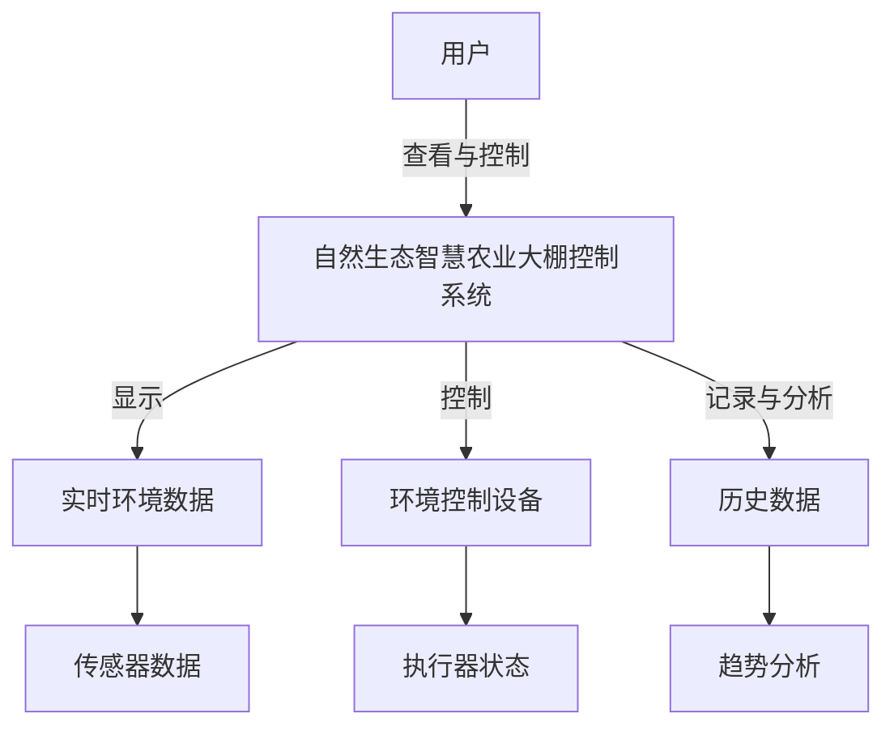

# 自然生态智慧农业大棚控制系统用户手册

## 系统简介

自然生态智慧农业大棚控制系统是一个基于现代前端技术的智能农业监控与管理平台，提供实时监控、自动控制、数据分析等功能，旨在为农业大棚作物提供最佳生长环境。

## 系统功能概述

自然生态智慧农业大棚控制系统提供以下核心功能：

1. **实时监控** - 实时显示农业大棚环境参数，如温度、湿度、光照等
2. **环境控制** - 自动或手动控制农业大棚环境设备
3. **数据分析** - 提供历史数据查询、趋势分析和预测功能
4. **报警管理** - 当环境参数异常时自动报警，支持灵活的阈值和延迟设置
5. **系统设置** - 配置系统参数和用户偏好
6. **环境模拟** - 支持两种环境模拟模式：传统波形和天气驱动模式

## 系统使用指南

### 1. 系统登录

- 打开浏览器访问系统地址
- 输入用户名和密码登录系统
- 首次使用默认账户：用户名 `admin`，密码 `admin123`
- 建议首次登录后立即修改默认密码

### 2. 系统界面导航

系统界面分为四个主要部分：

1. **顶部导航栏** - 提供系统主要功能区域切换
2. **侧边菜单** - 提供当前功能区域的子功能导航
3. **主内容区** - 显示当前功能的主要内容
4. **状态栏** - 显示系统状态和简要信息

### 3. 实时监控功能

实时监控是系统的主要界面，提供农业大棚当前环境状态的全面视图。

#### 3.1 仪表盘使用

仪表盘页面展示所有环境参数的实时状态：

- **参数卡片** - 每个环境参数以卡片形式展示，包含当前值、单位和状态
- **状态指示** - 不同颜色表示参数状态：绿色(正常)、黄色(警告)、红色(危险)
- **趋势箭头** - 显示参数变化趋势：上升、下降或稳定
- **自动刷新** - 数据默认每秒自动刷新一次

#### 3.2 图表查看

点击任意参数卡片可查看该参数的实时趋势图：

- **时间范围** - 支持选择不同时间范围：最近1小时、6小时、24小时等
- **数据缩放** - 使用鼠标滚轮或触控手势可缩放图表
- **数据提示** - 鼠标悬停在数据点上可查看详细数值和时间
- **图表导出** - 支持将图表导出为图片或数据文件

### 4. 环境控制功能

环境控制页面提供对农业大棚环境控制设备的操作界面。

#### 4.1 控制模式

系统支持两种控制模式：

- **自动模式** - 系统根据设定的目标值和当前环境参数，自动控制设备运行
- **手动模式** - 用户手动设置设备运行状态和功率

#### 4.2 子系统操作

系统包含以下主要控制子系统：

- **通风系统** - 控制空气温度和湿度
- **加湿系统** - 增加空气湿度
- **补光系统** - 提供额外光照
- **灌溉系统** - 控制土壤湿度
- **CO2系统** - 控制二氧化碳浓度
- **加热系统** - 增加空气温度
- **制冷系统** - 降低空气温度

每个子系统提供以下操作：

1. **模式切换** - 切换自动/手动模式
2. **功率调节** - 手动模式下调节设备功率(0-100%)，通过改进的滑块控制，提供即时反馈
3. **状态查看** - 查看当前设备运行状态和功率
4. **目标设置** - 设置自动模式下的目标参数值

#### 4.3 滑块控制操作

系统中所有滑块控制都采用无延迟反馈设计：
- **即时响应** - 滑块拖动时环境参数立即响应，无延迟动画
- **精确控制** - 可通过键盘箭头键精确调整一个百分点
- **数值显示** - 实时显示当前设置的百分比值
- **视觉反馈** - 滑块颜色变化提示当前功率水平

### 5. 数据分析功能

数据分析页面提供农业大棚历史数据的查询和分析功能。

#### 5.1 历史数据查询

- **时间范围** - 选择查询的起止时间
- **参数选择** - 选择要查询的环境参数
- **数据表格** - 以表格形式展示查询结果
- **数据导出** - 支持导出CSV或Excel格式

#### 5.2 数据分析图表

- **趋势分析** - 显示参数随时间的变化趋势
- **对比分析** - 对比不同参数或不同时间段的数据
- **统计分析** - 提供平均值、最大值、最小值等统计指标
- **预测分析** - 基于历史数据预测未来趋势

### 6. 报警管理

系统提供完善的报警功能，帮助及时发现环境异常。

#### 6.1 报警设置

报警设置页面提供了更加灵活的报警配置：

- **总开关控制** - 系统级报警主开关，控制整个报警系统的启用/禁用
- **参数分组** - 报警按环境参数和系统异常分组管理
- **参数级开关** - 每个环境参数都有独立的报警开关
- **阈值设置** - 通过滑块直观设置每个参数的最小值和最大值阈值
- **报警延迟** - 设置超出阈值后多长时间触发报警（秒），避免瞬时波动误报
- **报警方式选择** - 可选择多种报警通知方式：界面提示、声音提醒、邮件通知等

#### 6.2 报警历史

- **报警记录** - 查看历史报警记录，包含触发时间、参数名称、参数值和阈值信息
- **报警筛选** - 按时间、参数或严重程度筛选报警
- **报警统计** - 查看报警频率和分布统计
- **报警导出** - 支持导出报警记录为CSV文件

### 7. 环境模拟设置

环境模拟设置页面允许配置系统环境仿真模式：

#### 7.1 模拟模式选择

- **传统波形模式** - 基于三角函数生成环境参数波动，计算简单
- **天气驱动模式** - 基于物理模型和天气数据的高精度模拟，更加真实

#### 7.2 大棚物理参数设置

天气驱动模式下，可以调整以下大棚物理参数：
- **保温性能** - 影响热量传递速率
- **光线透过率** - 影响阳光辐射热量和光照强度
- **气密性** - 影响空气交换速率
- **体积** - 影响环境参数变化速率
- **覆盖面积** - 影响光照吸收面积

#### 7.3 天气数据来源

- **模拟天气** - 使用系统生成的模拟天气数据
- **历史天气** - 使用历史真实天气数据
- **天气类型设置** - 在模拟天气模式下可选择特定天气类型进行测试

### 8. 系统设置

系统设置页面提供各种配置选项：

- **用户信息** - 修改用户名、密码和联系方式
- **显示设置** - 配置界面主题、刷新频率等
- **数据设置** - 配置数据存储策略、备份选项等
- **设备设置** - 配置控制设备参数和运行策略

## 常见问题解答

### Q1: 系统支持什么浏览器?

A1: 系统支持所有现代浏览器，包括Chrome、Firefox、Edge和Safari的最新版本。建议使用Chrome或Edge获得最佳体验。

### Q2: 数据存储在哪里?

A2: 数据存储在浏览器的IndexedDB中，属于本地存储。建议定期导出重要数据作为备份。

### Q3: 如何设置合理的报警阈值?

A3: 报警阈值应根据作物类型和生长阶段设置。系统提供了常见作物的参考阈值，可在报警设置页面的"参考值"选项中查看。

### Q4: 报警设置中的延迟时间有什么用?

A4: 延迟时间可以避免环境参数短暂波动导致的误报。例如，如果设置温度超过35℃报警，延迟30秒，则只有当温度持续超过35℃达30秒以上才会触发报警。

### Q5: 为什么选择天气驱动模式?

A5: 天气驱动模式基于物理模型，能够更真实地模拟大棚环境变化，并保持参数变化的平滑性和连续性，特别适合进行控制策略测试和操作员培训。

### Q6: 系统控制滑块的操作技巧?

A6: 除了直接拖动滑块外，还可以：
- 点击滑块轨道直接跳转到指定位置
- 使用键盘箭头键微调（左右键±1%，上下键±5%）
- 双击滑块恢复默认值

### Q7: 系统是否需要联网?

A7: 基本功能不需要联网即可使用。但数据备份和多设备同步功能需要网络连接。如使用实时天气数据进行环境模拟，也需要网络连接。

## 联系与支持

如有任何问题或需要技术支持，请联系：

- **电子邮件**: support@intelligriculture.com
- **技术支持电话**: 400-123-4567
- **官方网站**: www.intelligriculture.com

---

*版权所有 © 2024 IntelliAgriculture. 保留所有权利。*
