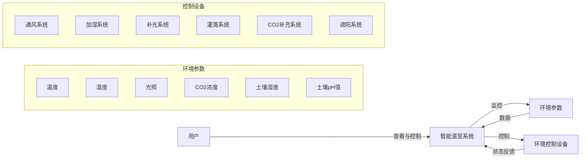
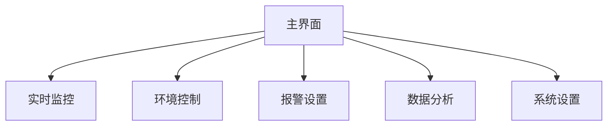
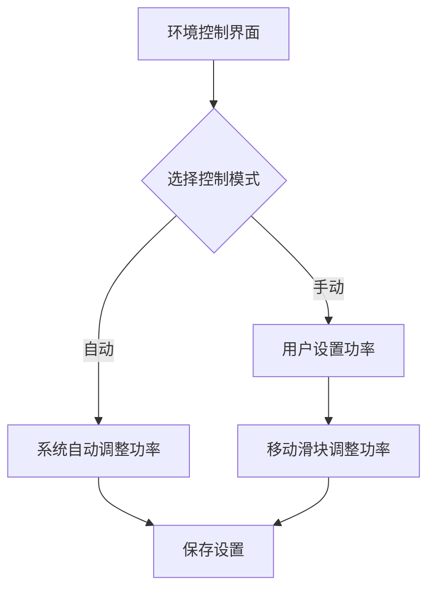
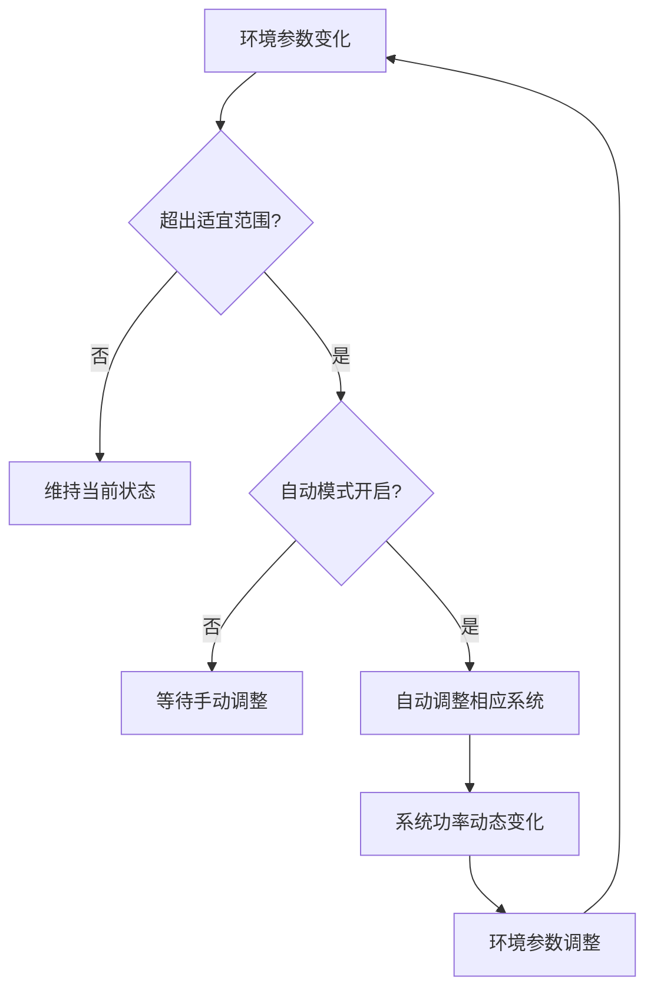

# 智能温室环境控制系统用户手册

## 1. 系统简介

智能温室环境控制系统是一个基于现代前端技术的智能温室监控与管理平台，提供实时监控、自动控制、数据分析等功能，旨在为温室作物提供最佳生长环境。

## 2. 系统要求

### 2.1 推荐浏览器
- Chrome 80+
- Firefox 75+
- Edge 80+
- Safari 13+

### 2.2 设备支持
- 桌面电脑（推荐）
- 平板设备
- 移动设备（响应式支持）

## 3. 界面导航

### 3.1 系统导航栏

系统左侧导航栏提供对主要功能的访问：

- **实时监控** - 查看当前温室环境数据
- **环境控制** - 调整各子系统状态和功率
- **报警设置** - 配置环境参数警报阈值
- **数据分析** - 查看历史数据和趋势图表
- **系统设置** - 调整系统常规设置

## 4. 功能操作指南

### 4.1 实时监控

实时监控页面显示当前环境参数和子系统状态。

**操作步骤：**
1. 点击左侧导航栏的"实时监控"
2. 查看各个参数的实时值和历史趋势
3. 可切换时间范围：最近1小时、24小时、7天、30天

**界面元素：**
- 环境参数卡片 - 显示各参数当前值
- 历史趋势图表 - 展示参数变化趋势
- 系统状态指示器 - 展示各子系统当前状态

### 4.2 环境控制

环境控制页面允许您调整各子系统的运行模式和功率。

**操作步骤：**
1. 点击左侧导航栏的"环境控制"
2. 选择要控制的子系统（通风、加湿、补光等）
3. 使用开关切换自动/手动模式
4. 在手动模式下，使用滑块调整功率

**自动与手动模式：**
- **自动模式** - 系统根据环境参数自动调整功率
- **手动模式** - 用户手动控制功率百分比

### 4.3 报警设置

报警设置页面允许配置环境参数的警戒阈值。

**操作步骤：**
1. 点击左侧导航栏的"报警设置"
2. 调整各参数的警戒上限和下限
3. 设置报警通知方式
4. 点击"保存"按钮应用更改

**配置参数：**
- 温度警戒值（默认：30℃）
- 湿度警戒值（默认：80%）
- CO2浓度警戒值（默认：800ppm）
- 光照强度警戒值（默认：3000lux）
- 土壤湿度警戒值（默认：85%）

### 4.4 数据分析

数据分析页面提供历史数据图表和统计信息。

**操作步骤：**
1. 点击左侧导航栏的"数据分析"
2. 选择要分析的参数
3. 设置时间范围
4. 查看生成的图表和统计数据

**分析功能：**
- 参数趋势图
- 日/周/月平均值比较
- 参数相关性分析
- 数据导出功能

### 4.5 系统设置

系统设置页面提供系统配置和维护功能。

**操作步骤：**
1. 点击左侧导航栏的"系统设置"
2. 修改系统配置参数
3. 执行维护操作
4. 点击"保存"应用更改

**主要设置：**
- 默认自动控制开关
- 数据更新间隔
- 数据库维护选项
- 界面定制选项

## 5. 故障排查

### 5.1 常见问题

| 问题 | 可能原因 | 解决方法 |
|------|---------|---------|
| 数据不更新 | 浏览器缓存问题 | 刷新页面或清除缓存 |
| 控制命令无响应 | 网络连接问题 | 检查网络连接，重新加载页面 |
| 图表不显示 | 浏览器兼容性问题 | 使用推荐的浏览器版本 |
| 系统运行缓慢 | 数据库过大 | 执行数据清理操作 |

### 5.2 联系支持

如遇到无法解决的问题，请联系技术支持：

- 技术支持邮箱：support@intelliagriculture.com
- 技术支持热线：400-123-4567

## 6. 系统维护

### 6.1 数据管理

系统会自动管理数据存储，但您可以手动执行以下维护操作：

**数据清理：**
1. 导航至"系统设置"
2. 找到"系统维护"部分
3. 点击"清理历史数据"按钮
4. 确认操作

**注意：** 默认情况下，系统将保留最近7天的数据，清理操作不可撤销。

### 6.2 性能优化

如果系统运行变慢，您可以尝试以下优化：

1. 减少数据更新频率（在系统设置中）
2. 清理历史数据
3. 减少同时打开的图表数量
4. 使用推荐的浏览器和设备

## 7. 附录

### 7.1 环境参数参考表

| 参数 | 适宜范围 | 警戒值 | 单位 | 说明 |
|------|---------|-------|------|------|
| 空气温度 | 20-30 | 30 | ℃ | 超过警戒值启动通风 |
| 空气湿度 | 60-80 | 80 | % | 过高启动通风，过低启动加湿 |
| 光照强度 | 2000-3000 | 3000 | lux | 过高启动遮阳，过低启动补光 |
| CO2浓度 | 400-800 | 800 | ppm | 低于目标值启动补充 |
| 土壤湿度 | 70-85 | 85 | % | 低于目标值启动灌溉 |
| 土壤pH值 | 6.5-7.5 | - | pH | 监测用，不直接控制 |

### 7.2 控制系统响应逻辑

